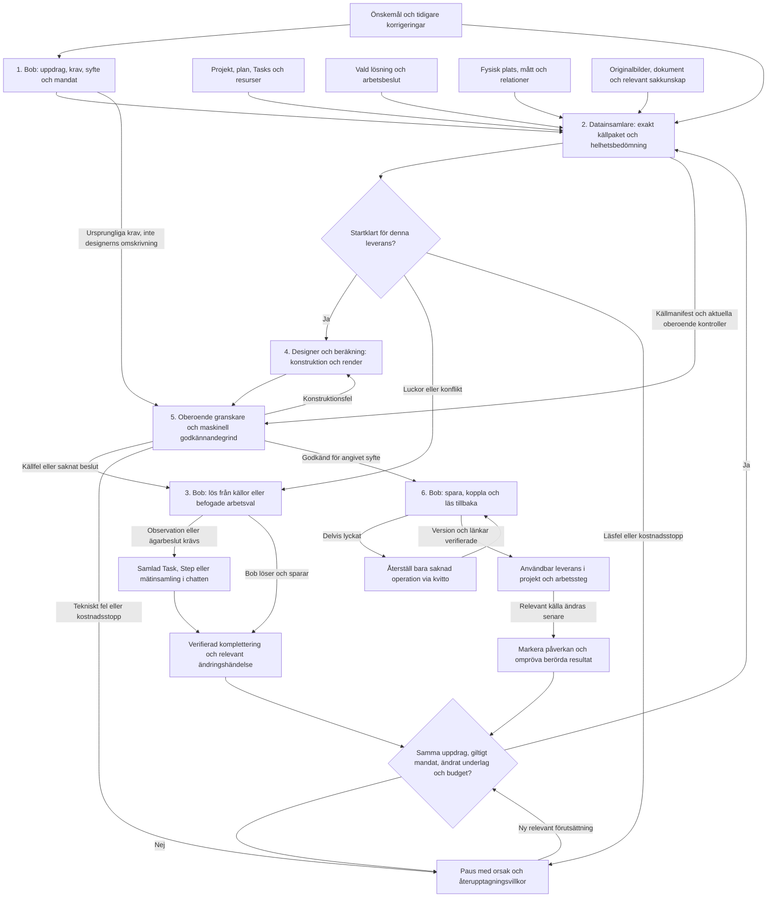

# Bob — från önskemål till användbar leverans

> **Status: specificerat målkontrakt och implementeringsförslag.** Produktmandatet i [user-stories.md](user-stories.md) gäller redan. Designvalen och etapperna här är underlag för implementation, inte bevis på levererad funktion.
>
> **Äger:** sambandet mellan datans väg, ansvar, överlämningar, fortsatt arbete och leveransacceptans. **Äger inte:** en ny ordlista, arbetsstruktur, databasmodell, CAD-motor, verktygskatalog eller V1-roadmap. Befintliga domänägare nedan behålls. Kvarstående arbete finns i [State](#state); daterade kontroller och tidigare överlämning hör till [arkivet](archive/bob-delivery-flow-review-2026-09-29.md).

**Fortsätt här:** [State och nästa handling](#state) · [P0:s arbetspass](#p0) · [Prioriteringar](#plan) · [Acceptansfall](#acceptans).

## 1. Utfallet vi vill ha

**Bob driver ett levande projekt. Chatten är kontaktytan, inte projektets databas eller arbetskö.** Användaren anger mål och mandat samt bidrar med observationer på plats. Bob ansvarar för att nästa meningsfulla resultat blir användbart, eller att ett verkligt hinder får en ansvarig och en bestämd fortsättning.

| Utfall | Observerbart klart-villkor |
|---|---|
| U1. En beställning räcker | Komplett relevant underlag leder till granskad, sparad och tillgänglig leverans utan ytterligare ”fortsätt” eller nytt tillstånd för normala förberedelser. |
| U2. Verklighet och avsikt blandas inte ihop | Användarkrav, uppmätt/rapporterad verklighet, specifikation, vald lösning, Bobs arbetsval, beräkning, uppskattning och okänt går att skilja åt hela vägen. |
| U3. Komplettering blir arbete | Samtliga nödvändiga luckor för nästa leverans samlas, befintlig Task/Step återanvänds och svar återupptar samma uppdrag. Oberoende arbete kan fortsätta. |
| U4. Underlaget går att lita på för sitt angivna syfte | Varje styrande mått, placering och beräkning har spårbart ursprung. Otillgängligt underlag blir inte ”godkänt” bara för att en modell säger det. |
| U5. Resultatet finns där arbetet sker | Rätt Artifact-version nås från projektet och relevanta Steps/Tasks efter omladdning och av en annan behörig deltagare. Privat chatt behövs inte. |
| U6. Ändringar och fel hanteras utan omstartskaos | Ändrade källor påverkar rätt resultat. Tekniska fel, kunskapsluckor, kvalitetsfel och kostnadsstopp har olika fortsättningar. Sparat eller utfört arbete förloras inte. |

Detta konkretiserar främst UC-001, UC-003 och UC-005. Samma ansvarskedja ska stödja UC-002:s byggdagar, människor och material samt UC-004:s manuella underlag. En korrekt ritningsleverans avslutar ritningsuppdraget, inte hela byggprojektet.

## 2. Dokumentationsägare och designval

### Befintliga ägare

| Område | Ägare som ska användas vid implementation |
|---|---|
| Mål, termer och arbetsstruktur | [User stories](user-stories.md), [domain dictionary](domain-dictionary.md), [living project plan](living-project-plan.md). Project → optional Area → Step → Task. Task-instruktioner är inte planens Steps. |
| Fysisk plats och källuppgifter | [Building model](building-model.md), [project facts](project-facts.md), [media and steps](media-and-steps.md). |
| Lösning, konstruktion och leverans | [Solutions](solutions.md), [CAD adapter](cad-adapter.md), [artifacts](artifacts.md), [material assembly use case](material-assembly-use-case.md), [material planning](material-planning.md). |
| Kontext, verktyg och återhämtning | [Context](ask-bob-context.md), [context implementation](ask-bob-context-implementation.md), [tools](ask-bob-tools.md), [writes](ask-bob-writes.md), [conversations](ask-bob-conversations.md), [shared background calls](shared-ai-background.md). Deras statusmarkeringar gäller; en specifikation är inte runtime. |
| Implementation, behörighet och UI | [Database](../db/README.md), [AI seam](../supabase/README.md), [UI index](ui-index.md), [verification](../.claude/skills/verify/SKILL.md). UI använder `src/data/database.ts`. |
| Löpande status och releaseordning | [Function inventory](function-inventory.md), [V1 plan](v1-plan.md). Etapperna här gäller leveransflödet, inte en konkurrerande produktroadmap. |

### Designval

| ID | Val och konsekvens |
|---|---|
| D1 | **Ett gemensamt projekt, separata sorters sanning.** Plats/objekt beskriver verkligheten; projektet beskriver förändringsarbetet; vald lösning beskriver avsikten; Artifact beskriver ett versionerat resultat. En Area är inte ett rum. Ett fristående bygge kräver inte en påhittad byggnad. |
| D2 | **En ansvarig Bob, avgränsade specialister.** Bob äger mål, framdrift och normala arbetsval. Datainsamlare, designer och granskare har kontrakt, inte egna konkurrerande projektminnen. Ett led behöver inte alltid vara ett separat modellanrop. |
| D3 | **Källor parallellt, inte en kedja av sammanfattningar.** Exakta poster, bilder och beslut följer med från respektive ägare. Sammanfattningar hjälper navigering och relevans men ersätter inte styrande källvärden. |
| D4 | **Startklarhet beror på leveransens syfte.** Illustration, konceptlayout och tillverkningsunderlag har olika krav. Ett lägre detalj- eller säkerhetsläge får inte tyst ersätta den beställda leveransen. |
| D5 | **AI tolkar och konstruerar; kontrollerbara funktioner hämtar, räknar och spärrar.** Kända värden används exakt. Val av relevant källa är fortfarande ett semantiskt ansvar som måste gå att granska. |
| D6 | **Båda riktningarna är obligatoriska.** Tillräckligt underlag ska leda vidare; otillräckligt underlag ska inte passera. En spärr utan en tydlig återhämtningsväg är inte färdig design. |
| D7 | **Samma uppdrag över kompletteringar.** Leveransuppdraget är operativt arbetsläge, inte ett extra lager i Project/Area/Step/Task-hierarkin. Nya försök får nya försöks-ID:n men behåller uppdragets identitet. |
| D8 | **Kravstyrd kontext vid behov.** Ett litet projektkort är alltid tillgängligt. Exakta källor, relevanta bilder och versionshanterat arbetskunnande hämtas när nästa handling kräver dem. Budgetar och avkortning syns. |
| D9 | **Mottagaren kontrollerar överlämningen.** Modellens ”klart” är inte ett spar-, gransknings- eller leveranskvitto. Behörighet, fullständighet, källaktualitet och format kontrolleras vid gränsen. |
| D10 | **Versionsspårning, inte ny databas från grunden.** Bygg vidare på befintliga identiteter och revisionsmekanismer. Föreslagen källgraf är ett logiskt kontrakt; valet av tabeller/JSON/relationsindex hör till senare implementation. |

## 3. Gemensamt flöde — datans och arbetets väg

Pilarna från projekt, fysisk plats, lösning och medier är **parallella källflöden**. De måste inte alla passera genom Bobs egen text. Granskaren får både kandidaten och en kontrollerbar koppling tillbaka till originalunderlaget. Kompletteringsslingan är villkorad; diagrammet ger inte tillstånd till oändliga modell- eller renderanrop.

## 4. Kontrakt per led

Fälten nedan är logiska kontrakt. Befintliga verktygsnamn, tillstånd och databastabeller ändras inte av dokumentet.

| Led och ansvarig | Källor och indata | Startvillkor | Utdata och klart-villkor | Nästa åtgärd vid olika utfall |
|---|---|---|---|---|
| **1. Bob formulerar uppdraget** | Aktuellt meddelande, tidigare rättelser, projektkort, aktuell Step och befintliga uppdrag. | Verifierad projektidentitet, användarbehörighet och ett mål att arbeta mot. | Stabilt uppdrags-ID; beställt syfte/detaljnivå; identifierade krav med ursprung; målobjekt, vald lösning och leveransplats hålls isär; mandat och kostnadsram är uttryckliga. Klart när mottagaren kan avgöra vad som ska levereras och vad som räknas som färdigt. | Giltigt uppdrag → 2. Saknat underlag hindrar inte beställning av insamling. Oklart avgörande mål → samlad fråga. Saknad behörighet → stoppa, inte söka runt åtkomstgränsen. |
| **2. Datainsamlaren bedömer hela underlaget** | Uppdraget samt parallella, behöriga källor: projekt/plan/Tasks, vald lösning, mått, fysisk plats/relationer, komponenter, material och bilder. | Giltigt uppdrag och ett avgränsat relevant sökområde. En saknad vald lösning får inte dölja andra luckor. | Exakta källposter/mediereferenser, lästäckning och bedömning av varje krav plus upptäckta nödvändiga beroenden. Klart när allt relevant inom deklarerad omfattning är bedömt eller begränsningen är explicit; inga tysta rest-sidor. | Tillräckligt → 4. Samlade kunskapsluckor/konflikter → 3. Läsfel, avkortning eller åtkomstproblem → särskilt tekniskt utfall med kvarvarande luckor bevarade. Den billiga modellen får inte ensam förklara oläst underlag irrelevant. |
| **3. Bob löser kompletteringar** | Hela lucklistan, befintliga källor och Tasks/Steps, mandat, lösningsalternativ och konflikter. | Uppdraget är aktivt och luckornas innebörd känd. | Befogade beslut och korrigeringar sparas genom rätt domänkommandon. Kvarstående observationer får återanvänd eller ny Task/Step, alternativt strukturerad mätinsamling i chatten. Varje lucka har ansvarig, svarssätt och blockerad leverans. Klart när kvarvarande luckor är samlade och arbetsläget sparat — eller när allt är löst. | Relevanta sparade kompletteringar → 2 i samma uppdrag. Väntan på användaren → parkera med konkret återupptagningsvillkor; fortsätt oberoende arbete. Skrivfel → återställ den skrivningen. Ingen fråga om nytt lov när befintligt mandat räcker. |
| **4. Designer konstruerar och renderar** | Godkänt intag, ursprungliga krav, exakt lösningsversion, källmanifest, relevanta bildpixlar och konstruktionskunskap. | Mottagaren bekräftar intagets giltighet, nödvändiga källor/bindningar, förmåga, behörighet och återstående budget. | Kandidat med konstruktion, beräkningsberoenden, geometri, delar/placeringar, vyer, exporter, hashvärden och öppna kontroller. Klart när kandidaten faktiskt renderats och inga tekniska diagnoser utger sig för att vara leverans. | Kandidat → 5. Upptäckt källlucka/konflikt → 3/2, inte påhittat mått. Konstruktionsfel → avgränsad korrigering. Render-/modellfel eller kostnadsstopp → korrekt pausorsak, inte en ny konstruktion som felsökningsmetod. |
| **5. Granskaren bedömer; servern avgör om grinden öppnas** | Exakt kandidat, originalkrav, intag, bildreferenser, aktuella oberoende källkontroller och deterministiska kontrollresultat. | Samma kandidat- och källfingeravtryck; obligatoriska källor lästa; relevanta bilder levererade; granskningsförmåga och budget finns. | Kravtäckning, konkreta avvikelser och godkännande för uttryckligt syfte. Klart först när maskinella villkor och semantisk granskning båda godkänner. Resultatet binds till kandidat, krav, källversioner och granskningsversion. | Godkänt → 6. Geometri/konstruktion → 4 med specifika ändringar. Källfel/beslutsfel → 2/3. Ofullständig nödvändig evidens, tekniskt fel eller kostnadsstopp → ingen sparbar godkänd kandidat. |
| **6. Bob sparar, kopplar och levererar** | Godkänd exakt kandidat, käll-/kravfingeravtryck, förväntad Artifact-revision, rätt projekt och Steps samt befintliga kvitton. | Behörighet, mandat och källaktualitet kontrolleras igen vid spargränsen. Inget konkurrerande avslut har redan sparat samma leverans. | Versionskvitto, exakta steglänkar och återläsning från avsedd projektyta. Klart när rätt innehåll och länkar faktiskt är tillgängliga; utfallet anger syfte och återstående fysiska kontroller. | Komplett → levererat. Fil sparad men länk saknas → reparera länken utan ny generering. Skrivkonflikt/ändrad källa → uppdaterad bedömning, aldrig blind överskrivning. Bruten åtkomst → ärlig spärr, inte framgångsmeddelande. |

**Ändringsansvar efter leverans:** Bob ansvarar för konsekvensbedömningen. Domänkommandot publicerar vilken källa/version som ändrats; beroendeuppföljningen identifierar berörda leveranser; respektive domän hanterar omräkning, omgranskning eller ändringsarbete. Arbetets verkliga utförande och inköp skrivs inte om som om de aldrig hänt.

## 5. Källkontraktet — vad som måste följa med

### Identitet, innebörd och tillförlitlighet

Varje källa ska ha stabil typ/namnrymd + ID + revision eller oföränderligt innehållsfingeravtryck. Ett ensamt UUID eller en textetikett räcker inte. Uppgiften ska identifiera sitt objekt, sin egenskap och sin giltiga omfattning: fysisk plats, befintligt objekt eller viss lösningsversion.

Bevara ursprungligt värde, enhet, sanningsklass, uppgiftslämnare/källreferens och relevanta tidpunkter. Mätmetod, referenspunkter och precision/osäkerhet följer med när de är kända; okänt markeras, inte fylls i. `measured` är fortfarande rapporterat uppmätt enligt källan, inte en oberoende inspektion.

Befintliga `TruthState`-värdena i [project-facts.md](project-facts.md) ersätts inte med en ny enum här. **Användarkrav, lösningsval och beräkning är dessutom olika semantiska roller**, inte alternativa sätt att stämpla en fysisk mätning. Ett biblioteksmått eller produktblad är en specifikation; ett valt lådmått är ett arbetsbeslut; ett bildtolkat avstånd är en uppskattning.

### Gemensam överlämningsstruktur

| Del | Obligatoriskt innehåll i målkontraktet |
|---|---|
| Uppdrag | `request_id`, uppdragsrevision, `attempt_id`, projekt, målobjekt/fysiskt scope, valda lösningsreferenser, Step-/Task-destinationer, beställt syfte, krav-ID:n och mandat-/budgetreferens. |
| Källmanifest | Typ, ID, version/hash, exakt post eller återläsbar pin, objekt/egenskap, originalvärde/enhet, sanningsklass, ursprung och hur källan påverkar kravet. Inga fria projektreferenser från modellen utan serverkontroll. |
| Lästäckning | Sökområde, efterfrågade dataset/objekt, lästa sidor, återstående markörer, begränsningar, källor som faktiskt öppnats och status per obligatoriskt beroende. `empty`, `unread`, `unavailable`, `denied`, `truncated` och `conflicting` är olika tillstånd. |
| Bilder | Stabil mediaidentitet, revision/hash, syfte och koppling till objekt/viewpoint. Relevanta pixlar följer med till design/granskning och faktisk leverans till modellen kvitteras. Lagrade signerade URL:er eller privata pixelkopior i arbetsminnet ersätter inte källidentiteten. |
| Parameterursprung | Stabilt parameter-ID/sökväg i konstruktionen; `source`, `decision`, `derived`, `estimate` eller `unknown`; exakta käll-/beslutsreferenser; normaliserat värde/enhet och tillämpad transformationsregel. |
| Beräkning | Versionsbestämd, tillåten formel/operation; operandreferenser och revisioner; enheter, tolerans och avrundningsregel; resultat samt beroenden. Inte exekverbar modellskriven kod eller bara resultatet i fri text. |
| Kandidat och granskning | Geometri-, export- och preview-hash; källversionsvektor; krav-/syftesversion; relevanta kunskaps-/regelversioner; granskningsutfall, kravtäckning och vilka kontroller som återstår. |
| Leverans | Artifact-ID/revision, relationskvitton till rätt Steps/Tasks, idempotensnyckel och verifierad återläsning. Granskningshistorik är spårbarhet, inte permanent certifiering. |

### Bindningar gäller mer än en dels bredd

Alla **styrande** dimensioner, instansplaceringar, öppningar, avstånd och koordinattransformationer ska ha klassificerat ursprung. Direkt källbundet värde hämtas maskinellt från pinnen. Ett konstruerat värde pekar på ett dokumenterat arbetsbeslut. Ett härlett värde pekar på samtliga operander och beräkningsregeln. Godtycklig text i `assumptions` ersätter inte en saknad obligatorisk bindning.

Bevara originalenheten även när geometrin använder mm. Omvandlingen ska vara exakt inom den representerade numeriska precisionen; tolerans och avrundning är uttryckliga. En beräkning kan vara numeriskt exakt men fortfarande baserad på ett uppskattat underlag. Okänt är inte noll.

Exempel, inte projektdata: en fri öppning beräknas som totalbredd minus två sidstyckens tjocklek och ett beslutat spel. Alla fyra ursprung följer med. När tjocklekens källa ändras ska öppning, berörda delar och materialunderlag hittas via beroendena, inte genom textsökning efter samma siffra.

### Koordinater och riktningar

Ett koordinatsystem behöver identitet/version, origo, positiva axlar, längd- och vinkelenhet samt kända transformationer mellan del, konstruktion, rum och ritningsvy. Kamerans vänster är inte rummets väster. Vägg-/objektreferenser, hörn och öppningsriktningar ska vara identifierbara.

En kompassuppgift från användaren knyts till det avsedda objektet eller den avsedda bilden. Okänd transformation är en lucka när den behövs för leveransen. En genererad inspirationsbild får aldrig bestämma fysiska mått eller upphäva en senare rättelse.

### Konflikt och versionsbyte

Senast skrivet vinner inte automatiskt. Först jämförs objekt, egenskap, referenspunkter, användning och lösningsversion. Två aktiva poster kan vara legitima olika mått; V1/V2 i ett namn är inte i sig en revisionsrelation. Verklig ersättning länkas uttryckligt och gammal användning arkiveras/ersätts med historiken bevarad. En befintlig låda, ett nytt designmått och rummets utrymme får inte slås ihop.

Beroendena bildar en riktad acyklisk beräknings-/härledningsgraf. Cykler och saknade operander ska rapporteras. Ändring, arkivering, byte av vald lösning eller förlorad åtkomst kan göra en leverans inaktuell. Kontrollera källversioner vid intag, granskning, sparande och återöppning; relevanta ändringshändelser ger dessutom proaktiv påverkan. En tappad händelse får inte göra återöppningskontrollen överflödig.

Sparandet måste kontrollera samma förväntade revisioner vid den auktoritativa skrivgränsen, inte bara tidigare i AI-samtalet. Historiska leveranser bevaras. Ny källversion ogiltigförklarar inte automatiskt allt i projektet, bara resultaten som beror på den.

## 6. Just-in-time intelligence och kostnadsmedvetenhet

| När/vem | Vad som behövs just då |
|---|---|
| Alltid hos Bob | Mål, aktivt uppdrag/Step, mandat, budgetläge, viktiga begränsningar, öppna hinder, senaste ändringar och karta över tillgängliga källor/förmågor. Fem senaste hela meddelanden och äldre arbetsöversikt enligt samtalsägaren; exakta äldre källor går att återhämta. |
| Före nästa leverans | Syftes-/riskprofil med nödvändiga underlag, kontroller och acceptanskriterier. Profilen kombineras av arbetsmoment, material och miljö, inte ett särskilt manus för varje möbel. |
| Datainsamlare | Billig strukturerad listning, exakta ID-läsningar, sidmarkörer, relevanta relationer och bildmetadata. Semantisk sökning används där identiteter inte räcker. Resultaten visar vad som faktiskt lästs. |
| Bob vid lucka | Hela bedömningen, tidigare frågor/Tasks, möjliga alternativa källor, konstruktionsmandat och kostnaden/nyttan av nästa informationssteg. Svåra tolkningskonflikter eskaleras; samma billiga felbedömning upprepas inte blint. |
| Designer | Ett avgränsat men tillräckligt paket: exakta begränsningar, lösning, bildpixlar, konstruktionskunskap och tillåtna verktyg. Möjlighet att hämta mer när ett nytt faktiskt beroende upptäcks. |
| Granskare | Samma ursprungliga krav, exakt kandidat, källursprung, relevanta pixlar och oberoende aktualitets-/täckningskontroll. Inte bara designerns urval eller dess försäkran om att allt är rätt. |
| Sparande och felhantering | Aktuella behörigheter/versioner, kvitton, nästa tillåtna operation och felklass. En känd teknisk status kan levereras utan ett extra dyrt modellanrop för formuleringen. |

Versionshanterade kunskapspaket anger tillämpningsområde, källa, datum, nödvändiga frågor, kontroller och begränsningar. Nya/externt föränderliga sakkrav behöver verifierade källor. Säkerhetskritiska startkrav väljs inte bort bara för att relevansmodellen missade ett paket. Bob behöver både veta **vad verktyget gör** och **om det verkligen är tillgängligt**; [verktygsägaren](ask-bob-tools.md) behåller sitt mandat.

Ingen höjning av modellstorlek, promptlängd eller budget beslutas här. Först används billig hämtning och deterministiska kontroller; kvalificerat resonemang läggs på konstruktion, konfliktlösning och granskning. Kostnad följs per uppdrag/försök/led, inklusive misslyckade anrop. Ett stoppvärde är inte en garanterad faktureringsgräns för ett redan pågående anrop.

## 7. Uppdrag, återupptagning och olika fel

### Operativt arbetsläge, skilt från privat samtalsminne

Målbilden behöver ett beständigt uppdragsläge: mål, status, nästa handling, ansvarig, blockerande beroenden, senaste giltiga underlag, försöksfingeravtryck, kvitton och kvarvarande mandat/budget. Det får inte bara vara en mening i sammanfattningen.

Återanvänd befintlig jobbkörning, versionskontroll och kvittojournal där de passar. Blanda inte ihop projektets minsta nödvändiga uppdragsstatus med privata meddelanden eller specialistsamtal. Projektarbete ska i målbilden kunna fortleva efter en chattåterställning, men privata uppgifter får inte automatiskt publiceras. För den tidigare kontrollen av trådbundna ritningsutkast, se [arkiverad livscykelavgränsning](archive/bob-delivery-flow-review-2026-09-29.md#livscykel). Retention, avbrytande och eventuell behörighetsöverlämning måste regleras i respektive ägarkontrakt före implementation.

Ett svar via chatt, ett ändrat mätfält i UI och en avslutad mät-Task ska använda samma kanoniska domänuppdatering. En relevant händelse väcker det väntande uppdraget; mottagaren hämtar aktuella värden och kontrollerar att luckan verkligen är löst. Att någon klickat ”klar” bevisar inte att det saknade måttet finns.

### När får ett nytt försök starta?

Ett återupptagningsförsök kräver: aktivt uppdrag, giltig behörighet/mandat, rätt förväntad uppdragsrevision, kvarvarande eller uttryckligt nytilldelad budget samt en **meningsfull förändring**. Exempel är relevant ny källversion, löst konflikt, ändrat tillåtet arbetsbeslut, reparerad teknisk förutsättning eller ändrad kandidat efter konkret granskningsfeedback.

Fingeravtrycket bygger på uppdrag/krav, relevanta källversioner, syfte, kandidat och relevanta regel-/motorversioner — inte på nya tidsstämplar, formuleringar eller signerade URL:er. Dubbla händelser och samtidig körning får inte skapa dubbla kostnader eller leveranser. Enbart en ny chattvända är inte skäl att upprepa ett oförändrat misslyckande.

| Utfall | Ansvar och fortsättning |
|---|---|
| Tillräckligt och giltigt | Fortsätt till nästa led inom befintligt mandat. `ready` betyder redo för nästa led, inte sparat eller byggsäkert. |
| Verklig kunskapslucka | Bob söker befintligt underlag först; därefter samlad mät-/observationsuppgift. Återuppta när relevant information ändrats. |
| Källkonflikt | Bob utreder omfattning och ursprung; fysisk kontroll/ägare vid behov. Designer får inte lösa konflikten genom att välja snyggaste värdet. |
| Saknat avgörande ägarbeslut | Samlad beslutsfråga med alternativ och konsekvenser. Vanligt reversibelt konstruktionsval är inte automatiskt ett ägarbeslut. |
| Kvalitetsfel | Granskaren anger exakt krav, källa och korrigering samt ansvarigt led. Ny granskning först när relevant kandidat/underlag faktiskt ändrats. |
| Tillfälligt tekniskt fel | Begränsad återförsökspolicy med väntan/backoff och idempotens där operationen är säker. Reparera felande led; ingen ny konstruktion för att lösa nätfel. En begränsad transportretry är inte ett nytt designförsök. |
| Saknad förmåga eller permanent tekniskt fel | Parkera hos rätt systemansvar, ange vad som måste bli tillgängligt. Kalla det inte en saknad mätning eller ett krav på nytt ägargodkännande. |
| Kostnads-/anropsstopp | Spara läge och kvitton. Ingen automatisk budgetnollställning vid händelse, worker-segment eller nytt försöks-ID. Ny budgettilldelning är skild från nytt arbetsmandat. |
| Delvis lyckat sparande | Återläs kvitton och reparera bara saknad del, exempelvis Step-länk. Rendera inte om en redan sparad fil. |
| Ändrat mål, avbrutet uppdrag eller återkallad behörighet | Avbryt/ersätt enligt explicit status. Sen återkomst från specialist får inte skriva över det nya målet eller fortsätta under indragen åtkomst. |

## 8. UI och ärlig leverans

Projektets startsida visar nästa användbara handling, gällande primärt underlag, vad Bob arbetar med och vad som väntar på användaren. Samma Artifact kan länkas till flera Steps utan duplicerad fil. En Task och dess instruktioner använder rätt länktyp enligt befintliga ägare.

Visa skillnaden mellan skapas, kandidat under granskning, sparad, kopplad, levererad och inaktuell. Visa även varför arbetet står still. ”Nyaste version” är inte automatiskt rätt gällande arbetsversion. Ett äldre underlag kan behöva visas historiskt men får inte framstå som aktuellt.

Luckor blir begripliga handlingar: vilket mått/observation, mellan vilka referenser, med vilken bild och varför det behövs. Samla en relevant mätrunda, inte alla framtida frågor för hela huset. Ändring via UI och chatt påverkar samma projekt. Kompletterings-Task dedupliceras genom uppdrags-/luckidentitet, inte titelmatchning.

Behöriga deltagare ska kunna öppna rätt underlag efter omladdning utan Bobs privata chatt. Projektbehörighet ger inte automatiskt åtkomst till all byggnadsinformation eller andra deltagares privata information. Fysiskt arbete, säkerhetskontroller eller certifiering markeras inte utfört av att Bob producerar en fil.

## 9. Hitta rätt nuläge och underlag

Läs [State](#state) för kvarstående arbete och nästa handling. För vad appen faktiskt stödjer, använd [funktionsinventeringen](function-inventory.md) och respektive domänägare; återkontrollera berörd kod mot aktuell main inför implementation.

Den daterade kod-/datakontrollen och tidigare överlämningen finns i [granskningsarkivet](archive/bob-delivery-flow-review-2026-09-29.md). Arkiveringen flyttar bevis och historik, **inte öppna problem till ”klart”**. Åtgärderna för F3 ligger kvar i P0, F1/F2/F4 i P1 och uppdragslivscykeln i P2. Historiska test-/driftuppgifter får inte räknas som nya resultat.

## 10. Prioriterad implementeringsplan

**Ingen etapp implementeras eller driftsätts av denna dokumentationsändring.** Varje etapp behöver separat diffgranskning, verifiering mot aktuell main och uttryckligt beslut om eventuell datamigration/driftsättning. Den delade databasen får inte ändras tvärs över andra appars schemaägarskap.

| Prioritet | Leverans och designarbete | Ägare/berörda ytor | Klart-villkor |
|---|---|---|---|
| **P0 — stäng godkännandeluckan utan att stoppa giltiga leveranser** | Gör nödvändig källtäckning till ett maskinellt villkor före betald granskning/godkännande. Särskilj irrelevant ofullständig extrainformation från olästa obligatoriska beroenden; relevansen måste styrkas. Bevara alla luckor och returnera rätt teknisk fortsättning. Lägg först regression för ”läsfel + modellpass” och motsvarande komplett lyckat flöde. | CAD/intag/granskning; `cad-assistant.ts`, `drawing-review.ts`, `cad-review.ts`, befintliga tester och spargräns. Ingen generell schemaombyggnad. | Obligatoriskt läsfel kan aldrig ge sparbar godkänd kandidat. Komplett underlag kan fortfarande gå till sparad och kopplad Artifact utan extra ägarfråga. Tidigare giltig leverans bevaras vid fel. |
| **P1 — hela källkedjan och riktad datakvalitet** | Gemensam typad källidentitet; täckning för styrande dimensioner, placeringar, fysiska mått och beräkningar; beständig lineage på exakt Artifact-revision; källfingeravtryck och aktualitetskontroll. Utred barnrummets verkliga scope och vilka V1/V2-poster som ersätter varandra innan separat datarättning. | Project facts/building model/solutions/CAD/artifacts och `db/README.md`. Additiva versionerade förändringar där de behövs; bevara gamla versioner med ärlig ”ofullständig lineage”. | Källa kan följas från sparad dimension och tillbaka. Ändrad källa hittar rätt beroende. Fel enhet/scope, obunden obligatorisk parameter och gammal revision stoppas. Historik och andra projekt påverkas inte oavsiktligt. |
| **P2 — komplett uppdragslivscykel** | Definiera projektbeständig minimiidentitet kontra privat arbetsminne. Samlade luckor länkas till Task/Step/chat. Väck samma uppdrag av relevanta domänhändelser. Lägg versionslås, deduplicering, avbrytande, retryvillkor och beständig budgettilldelning/kvittoåterhämtning. | Living plan, conversations, writes, shared background calls och CAD request-store. | Både UI- och chattsvar återupptar samma uppdrag utan knuff. Dubbla händelser/återbesök ger inte nya kostnader eller dubbletter. Kostnadsstopp och indragen behörighet kan inte kringgås. |
| **P3 — rätt kontext och rätt projektyta** | Uppdragskort, källkarta, ändringsdelta och tydliga förmåge-/kunskapspaket; relevanta bilder levereras faktiskt. Visa leveransstatus, källstatus och samlade kompletteringar i befintliga UI-ytor. Separera gällande version från senaste förslag. | Context/tools/knowledge samt UI-index/artifacts/media. Vera granskar mobil, åtkomst och ärliga felstatusar. | Bob vet vad som behövs och var det finns; användaren ser varför han väntar och hittar rätt resultat efter reload. Inte ett separat nytt chatt- eller planeringssystem. |
| **P4 — faktisk produktacceptans** | Kör varierade verkliga modellflöden med komplett/ofullständigt underlag och kontrollerade fel, plus deltagar-/mobil-/återbesöksprov. Testa fler konstruktioner och större projekt med samma generella modell. | UC-001–005, verification och berörda domänägare. | Dokumenterade slutresultat och kostnader, inte enbart mocks eller bra svarstext. Endast uppfyllda delutfall markeras klara; hela UC stängs enligt user-stories. |

**Planens första implementationsetapp är P0; aktuell nästa handling finns i [State](#state).** Den utgår från [det daterade fyndet F3](archive/bob-delivery-flow-review-2026-09-29.md#fynd), har en avgränsad granskningsyta och ett tydligt positivt motprov. P1 är nästa strukturella steg; fysisk scope-rättning görs inte genom att gissa kopplingar eller arkivera allt som heter V1.

### 10.1 P0 — kodgranskning, reproduktion, fix och verifiering

**Arbetsmetod för P0.** Arbetssättet är ett avgränsat pass per etapp, med möjlighet att dela större etapper. Varje pass omfattar granskning, reproducerbara prov, avgränsad implementation och verifiering; planen får inte behandlas som bevis för att alla antaganden redan är riktiga. Aktuellt återstående arbete finns i [State](#state); genomförandebevis hör till [implementations-PR #159](https://github.com/EmelieHagander/Bob-the-builder/pull/159), inte en avslutslogg här.

**P0:s mål:** göra godkännandegränsen tillförlitlig utan fler onödiga stopp. Båda riktningarna krävs: obligatoriskt oläst underlag ska stoppa godkännande, och tillräckligt giltigt underlag ska kunna nå sparad och kopplad leverans inom befintligt mandat.

| Del | Arbete | Konkret utfall / bevis som ska lämnas |
|---|---|---|
| **P0.1 — granska hela den berörda kodvägen** | Kontrollera aktuell main, arbetsbranch och pågående ändringar. Följ intag → granskarens källhämtning → modellutslag → kandidatstatus/lagring → faktisk spargräns och steglänk. Sök alternativa verktygsvägar, återlästa kandidater och retryvägar; begränsa inte granskningen till den redan identifierade accepteringsgrenen. Kartlägg var obligatoriska källor bestäms och hur relevant lästäckning kontrolleras. | Kodkarta med exakta filer/funktioner/commit, möjliga kringvägar och föreslagen auktoritativ kontrollpunkt. Redovisa vad som är kodläst, testat respektive ännu okänt. |
| **P0.2 — reproducera före ändring** | Skriv/kör regressionen för obligatoriskt läsfel + modellens `pass` och följ även sparvägen. Lägg positivt motprov med komplett underlag samt ett fall med styrkt irrelevant oläst extrainformation. Kontrollera avkortning/paginering, åtkomstfel och återläst äldre kandidat där kodvägen motiverar det. | Ett test som visar felet före fix och oförändrade acceptanskrav för efterprovet. Exakta testnamn, kommandon, miljö och resultat; utebliven reproduktion rapporteras som sådan, inte som ett redan passerat test. |
| **P0.3 — minsta sammanhängande fix** | Inför maskinella villkor som modellens svar inte kan överrösta. Hantera nödvändig källtäckning före betald granskning och säkerställ att ingen berörd sparväg kan kringgå godkännandet. Bevara korrekta tidigare leveranser. Skilj läsfel från verkliga uppgiftsluckor och återför rätt nästa handling. | Avgränsad kodändring på separat implementationsbranch. Ingen generell databasombyggnad, gissad datarättning, ny agentuppdelning eller budgethöjning. Om någon sådan ändring faktiskt krävs ska beroendet och nytt scope redovisas, inte smygas in. |
| **P0.4 — verifiera båda riktningarna och granska diffen** | Kör regressionerna och relevanta tester/kontroller enligt [verify](../.claude/skills/verify/SKILL.md). Följ både det stoppade flödet och komplett underlag till sparad version, rätt steglänk och återläsning. Granska diff och felvägar separat från själva patchandet; ange vem eller vilket verktyg som faktiskt granskade. | Separat implementations-PR med bevis, kvarstående begränsningar och bedömning inför eventuell driftsättning. Fixture-/integrationstest, verklig modell-/CAD-körning och driftsättning redovisas separat; inget av dem får ersätta de andra i statusen. |

**Obligatoriskt kontra irrelevant:** oläst obligatoriskt underlag stoppar. Styrkt irrelevant extrainformation ska inte stoppa. Osäker relevans behöver utredas och får inte väljas bort enbart av samma modell som vill godkänna kandidaten. Intagets krav, källidentitet och användning måste ge en kontrollerbar grund för avgränsningen; P1:s fulla källgraf förklaras inte färdig av en smal P0-fix.

**P0:s utgångsprov:** [A06](#acceptans) ska förhindra godkänd sparbar kandidat vid nödvändigt läsfel även om modellen svarar `pass`. [A01](#acceptans) är det positiva motprovet hela vägen till tillgänglig leverans utan nytt lov. Berörda delar av A03, A11 och A13 kontrollerar lästäckning, korrekt felklass och bevarad delvis lyckad leverans. Om ett separat fel i ett senare led hindrar A01 ska P0:s spärrfix och den återstående leveransblockeringen rapporteras var för sig — inte sammanfattas som ”hela P0 klart”.

**Utanför P0:** fullständig parameter-/beräkningsspårning och riktad fysisk datarättning hör till P1. Händelsestyrd återupptagning efter ett senare UI-mått eller en Task-uppdatering hör till P2. P0 ska inte skapa nya frågor om redan givet arbetsmandat, men den får inte tillgodoräkna sig P2:s ännu overifierade fortsättning.

**Överlämningsgrind:** lägg test-/granskningsbevis i PR/CI eller relevant verifieringsägare, uppdatera berörda domänkontrakt och lämna endast nästa handling och kvarstående hinder i [State](#state). Arkivera avslutade delsteg med bevislänk; kvarstående acceptans-, merge- eller driftsättningsbehov ska fortfarande synas. Ingen automatisk merge, datamigration eller driftsättning ingår; kontrollera diff, målmiljö och uttryckligt mandat före varje sådan åtgärd.

## 11. Acceptansfall

Alla fall bedömer slutläget i data och avsedd UI, inte bara Bobs svar. Använd kontrollerade tester för mekanik och separat verklig modell-/deltagaracceptans för beteende. Exempelobjekten är fixturer, inte produktens tillåtna objektlista.

| ID | Situation | Krävt utfall |
|---|---|---|
| A01 | Komplett underlag och en beställning | Intag → konstruktion → granskning → sparad version → rätt Step-länk → återöppnad leverans. Noll extra knuffar eller nya frågor om normalt mandat. |
| A02 | Flera saknade uppgifter, varav en redan finns i äldre underlag | Befintlig uppgift återfinns. Alla återstående nödvändiga luckor samlas i en begriplig komplettering. Svar återupptar samma uppdrag och avslutar leveransen. |
| A03 | Relevant källa ligger efter första sidan eller äldre chattsammanfattning | Exakt källa hämtas med korrekt version. Avkortad sökning märks ofullständig, inte ”finns inte”. |
| A04 | Känd källa i cm/m och en beräknad dimension | Originalvärde/enhet och beräkningskedja finns kvar. Normaliserad geometri stämmer med deterministisk omräkning; uppskattning blir inte mätning. |
| A05 | Samtidigt aktiva V1/V2-etiketter | Objekt, egenskap och lösningsscope avgör om det är konflikt/ersättning/olika fakta. Ingen automatisk ”senast vinner” eller blind arkivering. |
| A06 | Granskarens obligatoriska källäsning misslyckas men modellen skulle svara pass | Ingen godkänd sparbar kandidat. Tekniskt utfall med källtäckning och rätt återhämtningsväg. Ett irrelevant oläst extraunderlag får däremot inte godtyckligt blockera A01. |
| A07 | Riktning korrigeras; referensbildens vänster skiljer sig från rumssystemet | Explicit koordinatkoppling används, rätt sida kontrolleras i alla berörda vyer och relevanta referenspixlar når granskaren. Okänd nödvändig transform blir en samlad lucka. |
| A08 | Styrande placering eller härledd dimension saknar ursprung | Mottagaren stoppar rätt led med konkret parameter-/källfel. En fri numerisk etikett eller allmän antagandetext räcker inte. |
| A09 | Källa ändras efter render eller samtidigt med save | Gammalt godkännande kan inte spara som om det gällde nya källor. Berörda resultat räknas om/omgranskas inom samma uppdrag. |
| A10 | Granskning hittar konstruktionsfel | Korrigeringen går till rätt led med krav/källa. Verifierade fakta bevaras. Oförändrad kandidat granskas inte mot betalning igen. |
| A11 | Render-/modell-/åtkomstfel | Rätt felklass och nästa handling; ingen teknisk diagnos blir projektleverans och inget nytt mätkrav uppfinns. |
| A12 | Kostnads- eller anropsgräns nås | Kvitton och läge bevaras. Inga nya betalda försök genom byte av turn/worker/försöks-ID. Explicit budgettilldelning återupptar arbetet utan att uppdraget beställs om. |
| A13 | Artifact sparas men steglänk misslyckas | Delvis lyckat visas. Bara saknad koppling repareras; samma Artifact/version återanvänds och kan öppnas efter reload. |
| A14 | Samma komplettering kommer två gånger eller via både UI och chatt | En kanonisk förändring och deduplicerat försök; inga dubbla Tasks, leveranser eller kostnader. |
| A15 | Återbesök nästa dag, chattreset eller målbyte | Målbildens projektuppdrag överlever privat reset utan att exponera privat historik. Avbrutet/ersatt uppdrag kan inte avslutas av en sen specialistrespons. Dagens trådbundna beteende ska inte räknas som detta prov. |
| A16 | Annan behörig deltagare på mobil öppnar arbetsuppgiften | Rätt version, syfte och instruktion kan användas utan privat chatt. Obehörig eller återkallad deltagare nekas vid riktig datagräns. |
| A17 | Användaren ber om tillverkningsunderlag men bara konceptunderlag räcker | Koncept får redovisas som delresultat, men ursprunglig leverans förblir ofullständig. Ingen dold nedgradering eller byggsäkerhetsstämpel. |
| A18 | Källbyte efter leverans; material redan köpt och moment utfört | Berörd leverans märks och ändringsarbete identifieras. Historiskt inköp/utförande bevaras. Orelaterat arbete återöppnas inte. |
| A19 | Fristående hylla, veranda, våningssäng och flerrumsrenovering | Samma begrepp, källkontrakt och generella förmågor fungerar utan nya objektspecifika verktyg; fysisk scope krävs bara när den behövs. |
| A20 | Byggdag med avbokning och materialförsening | Bob omplanerar berörda uppgifter med kompetens/beroenden bevarade. Deltagaren ser aktuellt arbete och underlag; utfört arbete görs inte ogjort. |

Mät minst: andel beställningar som når korrekt leverans utan extra knuff, korrekt samlad komplettering, falska godkännanden, falska stopp, parameterursprungens täckning, kostnad per accepterad leverans, onödiga upprepningar och felaktiga dubbletter. Rapportera testantal och spridning; ett enstaka lyckat modellförsök stänger inte hela användarfallet.

## 12. State — nästa arbete

**Nästa handling: avgränsa nästa P1-del för numeriska koordinatsystem och ursprung till placeringar/beräkningar.** Börja med noggrann kodgranskning av befintlig handoff, CAD-recept och spar-/återläsningsgräns. Välj ett sammanhängande negativt och positivt acceptansfall före implementation. Återanvänd projekt- och fysiska måttbindningar från [PR #160](https://github.com/EmelieHagander/Bob-the-builder/pull/160); börja inte om med P1a/P1b. Dess verifierings- och releasebevis hör till PR:n.

### Öppet arbete i prioritetsordning

| Etapp | Vad återstår? |
|---|---|
| **P1 — koordinater och parameterursprung** | Definiera versionsbestämda numeriska koordinatsystem och transformationer samt ursprung för instansplaceringar, arbetsval och beräkningar. Skilj bildens riktningar från rums-/konstruktionsaxlar. Låt kända källvärden, dokumenterade val och beräknade värden behålla olika innebörd. Okänd nödvändig transform ska ge en samlad lucka. |
| **P1 — obligatorisk täckning och samtidighet** | Kräv kontrollerbar täckning för varje styrande parameter i beställd leverans. Förfina relevant källtäckning utan att modellen kan välja bort oläst nödvändigt underlag. Kör verkliga samtidighetsprov för källändring/scopeförlust mot sparande; sekventiella SQL-fixturer och kodlästa lås är inte detta prov. |
| **P0/P1 — verkligt användarutfall, fortsatt öppet** | Kör driftsatt Bob med komplett underlag → granskad, sparad och åtkomlig leverans utan ytterligare knuff, inklusive källbundet projekt-/rumsmått och återöppnad detalj. Verifiera faktisk Auth/HTTP-väg och annan behörig deltagare. Tekniskt läsfel och återhämtning provas i avgränsad testmiljö. Användaren har valt att behålla P0:s användartest öppet medan P1 fortsätter. Rollbackat authenticated-role SQL-prov, CI och deployment stänger inte det. |
| **P1 — riktad datakvalitet** | Fastställ barnrummets rätta byggnads-/rumskoppling och verkliga ersättningsrelationer mellan måttposter innan data ändras. Utgå från daterade läskontroller i #160; V1/V2-etiketter räcker inte som bevis. Bevara historik och granska varje föreslagen datarättning. |
| **P2** | Lös uppdragets beständighet, samlad komplettering, återupptagning från chatt/UI/Task, deduplicering och budget-/kvittoåterhämtning. Oförändrade försök mellan turer och händelsestyrd väckning behöver egna kontroller; en same-turn-spärr räcker inte. |
| **P3** | Gör relevant kontext, kunskap, bildåtkomst och nästa handling tillgängliga för Bob samt visa rätt status och arbetsversion i UI. |
| **P4** | Verifiera varierade verkliga modell-/deltagarflöden, mobil, återbesök och felvägar; dokumentera slutresultat och kostnader. |

**Arbetsmetod:** håll ett avgränsat kodutfall aktivt åt gången. Följ källägare → faktisk spar-/återläsningsgräns, reproducera relevanta fel med negativa och positiva prov, gör minsta sammanhängande ändring och verifiera. Arkivera avslutade prov i PR/CI. Ange nästa kvarstående grind här, inte en historik över gröna körningar. Nya röda kontroller blir nästa handling.

**Granskningsperspektiv:** följ Archies befintliga prompt för placering, ägarskap och State samt [verify-instruktionen](../.claude/skills/verify/SKILL.md) för verifieringsgrindar. Beskriv faktisk granskningsmetod i PR:n; en manuell promptgenomgång är inte en oberoende subagentkörning. Nya fynd ska ha ansvarig kodgräns, prov och kvarstående åtgärd.

**Kvarstående acceptans:** A01:s verkliga användarutfall är öppet. P1 ska dessutom täcka A04/A05/A07/A08/A09/A18 för hela käll- och beräkningskedjan. `partial`-metadata och `legacy_untracked`-ritningar är inte fullständig spårning eller verifierad fysisk geometri.

**Arbetsgräns och ägare:** utgå från aktuell main och denna State; skapa nästa avgränsade implementationsbranch därifrån. `Docs/cad-adapter.md` äger CAD-kontraktet, [building-model.md](building-model.md) de fysiska begreppen och `db/README.md` databasgränsen och releaseordningen. Genomförd P1a/P1b-release är inte mandat att gissa datarättningar. Dubbelkontrollera aktuell diff, målmiljö och gällande användarmandat före nästa applicering eller driftsättning.

**Underhåll:** uppdatera nästa handling och öppna hinder enligt [Archies prompt](../.claude/agents/archie.md#forward-looking-state-and-archives). Gällande kontrakt stannar hos sina ägare. Länka körda prov och avslutade fynd från PR/CI eller daterat arkiv; kopiera inte tillbaka dem som en avslutslogg i State.
