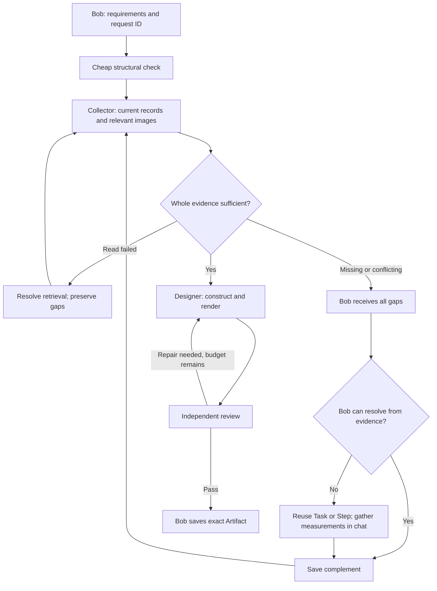

# Bob CAD adapter — build123d foundation

**Status:** engine foundation merged 2026-09-22. The September 24 CAD-assistant integration is tracked in [PR #123](https://github.com/EmelieHagander/Bob-the-builder/pull/123), whose release record owns migration, Edge and Pages status; the hosted Modal service was subsequently verified in PR #126/#127 (deployment details below). This is the first Slice B geometry foundation. Main commit `a9861000e011aba5a511455dea354e5c9d88a989` contains the adapter and worker. It does not complete the drawing/cut/pick/Shopping use case.

Bob never sends Python, SQL, URLs or arbitrary CAD code to the geometry engine. Bob produces a bounded, versioned construction request. The adapter validates it and a separate stateless worker translates it to build123d/Open Cascade.

## First contract

Contract v1 uses canonical millimetres. The September 25 extension adds cylinder blanks, local subtractive cuts and explicit geometry checks while retaining old box/tube recipes:
- reusable box definitions;
- reusable tube definitions;
- solid cylinders and up to 16 local box/cylinder cuts per definition (256 total), for holes and notches;
- placed/rotated instances;
- front, right, top and isometric projections.

The worker rejects cuts that miss the part, erase it or split it into disconnected solids. Each reusable definition is constructed once. Blank dimensions remain the original definition dimensions, not a smaller post-cut bounding box.

Every new manifest reports exact solid overlap volumes after a bounding-box broad phase. At most 256 candidate pairs receive the exact check; skipped pairs produce **partial**, never an all-clear. Optional `clearances` request up to 16 actual minimum surface distances for named instance pairs. Optional `motions` request up to 16 conservative envelopes for straight translations of up to eight moving parts against up to 32 named obstacles. A clear envelope establishes no overlap for that specified translation; a possible obstruction needs inspection. Rotating hinges, deformation, fastener strength and loads are outside these checks. Intentional joint overlaps remain visible for review. Old manifests explicitly show that no check was recorded.

The drawing viewer counts actual instances, shows blank dimensions and cut counts, and exports a CSV cutting list from the exact displayed recipe. The material tool derives quantities from the current saved Artifact revision; [material-planning.md](material-planning.md) owns allowance, compatible stock/reuse and Shopping. A part's opaque `material_ref` is not a pinned product specification. Board/sheet nesting, grain direction and saw-kerf optimization remain distinct work; the list does not claim these were solved.

A bed, shelf or cabinet is therefore content assembled from the same generic definitions and instances, not a new server-side object type.

The construction model remains Bob-owned truth. The CAD engine does not own project authority, measurements, material identity, revision history, stock or Shopping. A definition may contain an opaque material reference, but the worker never dereferences it.

## Engine

The worker pins **build123d 0.13.0**. PyPI identifies the release as Apache-2.0 and compatible with Python 3.11–3.14. build123d is a parametric BREP framework on Open Cascade and documents STEP export plus `project_to_viewport` / `ExportSVG` for 3D-to-2D projections.

The dependency is pinned. An engine upgrade is an explicit adapter-version change, not an automatic latest-version rollout.

## Output

One accepted assembly creates:
- a STEP assembly;
- requested SVG views from the same build123d assembly;
- a manifest containing exact engine/version, assembly bounding box, per-instance bounding boxes and SHA-256 export hashes.

The TypeScript adapter validates the request again at the Bob boundary and validates the returned engine identity and export manifest. Failure, timeout or malformed output is `unavailable`; it never becomes an empty successful drawing.

## Security and limits

The request has finite counts and numeric bounds. It contains no file paths, expressions, code or network destinations. Output filenames are chosen by the worker. The first worker is deliberately stateless.

The integration registers `design_project_cad` and `save_cad_design`. The first returns a checked candidate; the second saves that exact candidate through the claimed-turn receipt ledger. `cad-transport.ts` uses a deployment-owned HTTPS endpoint and bearer token; neither comes from the model. Do not embed Open Cascade in the Edge function and do not let the model choose a host.

## Verification

`cad-worker/test_worker.py` imports the real pinned build123d package and must generate STEP plus four SVG views. `tests/cad-adapter.test.ts` checks the Bob-side contract and failure semantics.

The dedicated `CAD adapter` workflow installs Python 3.13 and build123d 0.13.0 on GitHub Actions and runs both layers. PR #96 and the post-merge main run both passed: the real engine generated STEP/SVG and the TypeScript contract tests passed. This proves the adapter/engine seam, not hosted CAD availability in Bob, model behavior, structural engineering or BOM/Shopping completion.

## Historical integration sequence (superseded by the integration below)

The September 24 product mandate makes this integration a delivery gap for
[UC-001 and UC-005](user-stories.md#product-mandate--2026-09-24), not an optional
alternative to the legacy storage-box tool. The existing generic engine must
remain reachable through Bob in the deployed environment, persist under Artifact identity, and return views
that the relevant project step can display. A passing engine fixture alone does
not satisfy that outcome. Do not add a `bed_v1` tool to work around the missing
integration.

After this seam passes:
1. pin exact catalog material/part revisions in construction definitions;
2. persist the assembly recipe under the existing Artifact identity;
3. add bounded generic machining operations (holes, then rectangular cuts/pockets);
4. derive stable part IDs and drawing views from that same revision;
5. derive cut/pick/material requirements from it;
6. feed only remaining requirements into Shopping.

Constraints and formulas need a declarative vocabulary. They must never be executable Python expressions.

## CAD assistant integration — 2026-09-24

Bob delegates an intent plus optional Area, component, plan Step and Artifact identities. Read-only `cad-research/cad` mini/low collection precedes a separate `cad-designer/cad` standard/medium constructor; both use the shared Responses service. See the September 28 correction below for release status. Its short role describes a remote construction designer; there are no bed/drawer object-specific branches.

Its own bounded loop can search current project/physical records, inspect materials, open project images, read an exact saved CAD assembly and render up to four candidates across ten model rounds. After cheap source collection the constructor has one additional read batch before the first render or an indispensable blocker. Research reopens for inspection/repair while each reader has budget. Exact measurement verification and image grounding have separate bounded lookups. The designer budget is at most five minutes within the overall turn deadline, with at most 100 seconds per model call. Context starts with the brief and grows through reads. It can fetch wider constraints; object scope is not an artificial data-access blindfold. Bob retains the conversation, project decisions and final save authority.

Each render returns bounds, part metadata and geometry checks plus PNG views
rasterized from the **same exported SVGs** using pinned CairoSVG 2.9.1. The
transport verifies PNG dimensions/signature/hash and their source-SVG hashes.
The independent reviewer receives a valid candidate's pixels directly, without
another paid designer inspection first; on rejection the designer receives the
pixels and concrete feedback to research and repair. See the
[budget/review correction](#drawing-request-budget-and-review--2026-10-09) for
implementation and release status. Max dimension
is 1024 px, 512 KiB decoded per view, within the existing 6 MiB response bound.
This is visual feedback, not proof of physical fit or semantic correctness.

The rendering tool exposes a structured bounded recipe schema. Invalid input
reports paths such as `recipe.definitions[0].y_mm` and expected constraints.
Eight input corrections are separate from the four actual render attempts.
Unknown cross-record relationships remain errors; no validation is relaxed.

Images Bob has opened during the current turn are handed over by exact image ref
and reopened through the designer's caller-scoped adapter before its first call.
An unavailable selected reference stops that design attempt explicitly. A text
brief is not a substitute for the selected pixels. Images independently opened
by the designer use the same current-project/measurement grounding as Bob;
visual references do not override newer specifications. Existing image count,
byte and operation limits apply. Image authority/version is rechecked before
each designer call and after delivery. No project-wide automatic image scan or
new image store is introduced. The brief should make coordinate and viewing
directions explicit so that visual left/right is not confused with room axes.

Regression tests establish pixel handoff, fresh facts, unavailable-reference
failure and revocation before a later provider call. They do not establish
real-model fidelity to a particular reference or a finished construction drawing.

A detail selection uses exact instance IDs from a pinned source assembly. Definitions and placements are reused; the database rejects a changed/stale source and the UI flags later source changes. Changing the parent never silently rewrites a saved detail. Arbitrary construction revisions remain possible via a new bounded recipe.

`artifact_cad_revisions` stores recipe, verified export packet, source revision and optional component/plan-Step identity under the existing Artifact revision. Saves remain Concept and pass canonical target/measurement checks. A successful render does not certify structure, joints, site fit or measured truth. SVGs are displayed as image documents, not injected DOM; STEP is downloadable. Project-home previews and reusable work links are owned by [artifacts](artifacts.md#project-home-drawings-and-work-links--september-24-2026); Step links reopen an exact saved revision. Historical views survive a new turn and reload. Canonical archive/restore copies the exact CAD packet to the new revision. Generic Artifact revisions are rejected for CAD identities; only the guarded CAD save can replace their construction.

### Structured handoff and independent review — September 25

`design_project_cad` schema version 2 requires `handoff`: desired deliverable,
individually identified requirements with their basis/source refs, coordinate
origin and positive axes (unknown stays null), requested views, and open checks.
Bob carries relevant earlier corrections into these fields. The original current
owner request, caller-scoped reference pixels and server-read target accompany
that handoff. This is semantic intent, never a measured fact or new permission.
Source detail renders keep exact geometry/part identities and use the requested
views. No object names or language keyword tables select the workflow.

After a valid render, a separate `cad-reviewer/cad` model
conversation gets the same original request/handoff, exact recipe, engine checks,
generated previews, retained reference pixels and bounded research evidence.
Fresh project/measurement grounding and retained-image revocation checks apply
again. The reviewer has no tools, writer or designer response cursor. It returns
coverage for every requirement and explicit issues. Code rejects missing preview
pixels, omitted requested views, malformed/incomplete reviews and contradictory
passes with failed requirements/errors. Open site checks may remain warnings.
A rejected candidate returns to the designer with concrete feedback. At most
three reviews (initial plus two repair checks), four renders and ten designer
rounds fit the existing consultation deadline. A missing reviewer is an honest
technical blocker, not a request for owner approval. Only a passing review exposes
the exact candidate to Bob's save tool; a new render invalidates the old review.

The final designer call retains construction tools. If it renders a candidate,
the independent reviewer can inspect that exact output without another designer
call. Reviewer input identifies the project and linked Step and includes its own
bounded caller-scoped reads of project, approved plan, measurements and physical
room/element/relationship records, with incomplete coverage explicitly marked.
The shared review instruction treats previous drawing quality failures as a
reason for careful source comparison, including room openings and dimension
chains. [The September 28 investigation](bob-drawing-review-2026-09-28.md) records
the incident evidence and the distinction between tested mechanics and live
drawing fidelity.
The review fingerprint covers geometry, exports/previews, descriptions and scoped
source/target/work pins. The verdict is current-turn evidence, not a persistent
certification attached to every historical Artifact revision.

The reviewer is configured independently using the governed vision-capable mini
model at high reasoning. Its current governed output ceiling is **50,000 tokens**
(reasoning and verdict together), explicitly authorised by the owner and read back
on October 2; model and reasoning effort are unchanged. Since the
[AI catalog release](../supabase/README.md#ai-definition-catalog-and-model-tiers),
the execution profile is pinned for the job; enablement and model retirement
remain live checks. Request
cost/attempt/deadline guards remain separate. See the [configuration evidence and
remaining acceptance](foundation-verification.md#reviewer-output-ceiling--2026-10-02).

Historical progression: The initial 5,000-token setting was exhausted by two
live reviews without a usable verdict, including one with the corrected schema.
The September 26 release raises only the reviewer's governed output setting to
12,000 tokens (reasoning and verdict together). The call respects that setting
instead of silently clipping it at 5,000, with a 90-second call deadline bounded
by the existing consultation/worker deadline. This follows Launchpad's
separate producer/quality-gate pattern, inspected at `97b0b30e2aa08ef6770c03b1bb80a98edd995378`;
its HTML flag-and-ship policy is not used for a Bob candidate with unresolved
review errors. No Launchpad service integration is introduced.

Schema-only reviewer/localisation calls must omit `tools` entirely: the canonical
shared adapter suppresses structured response formatting when even an empty tools
array is present. The September 26 release probe exposed this integration gap;
`bob-structured-output-wire.test.ts` now exercises both production call sites
through the actual adapter and asserts strict `text.format` at the HTTP boundary.
The shared cross-app adapter itself is unchanged. Live acceptance is recorded in
the follow-up PR, separately from the initial merged implementation.

### Expert advice and design readiness — 2026-10-09

**Deployed 2026-10-09 through [PR #236](https://github.com/EmelieHagander/Bob-the-builder/pull/236).**
[Release evidence](foundation-verification.md#expert-advice-and-design-readiness-release--2026-10-09)
owns exact installation and preservation checks.
[The Solution owner](solutions.md#shared-expert-advice-and-design-intent--2026-10-09)
defines shared advice, actual chosen direction, mandate, references and bounded
output-purpose deferrals. Bob develops that supported direction within the
existing authority; significant choices do not automatically require owner
approval. A checked numeric construction is not advisory readiness.

`save_construction_draft` checks canonical readiness for purpose `construction`
before a new save, with the same check at the database writer under source locks.
CAD checks the exact selected Solution before paid research, design or review,
including the checked-construction path. Missing/open intent returns `needs_data`;
unreadable source evidence returns `unavailable`. The exact ready pin is refreshed
through rendering, review and save, so changed target/intent cannot silently
replace the chosen revision.

Saved Solution features are merged into the handoff as stable `intent_<id>`
requirements. Original referenced images are opened through caller-scoped access,
and their source versions accompany the same pin to Daisy and Rita. Reference
roles guide interpretation; image content remains design intent, not measured
truth. CAD saves require the exact `bob_design_intent` and `bob_design_images`
manifest entries, with canonical target and fresh image-version validation.
Bounded illustration/concept deferrals remain visible in the handoff; they cannot
authorize construction-purpose work. Reviewer feature coverage applies equally
to freshly designed and checked-construction candidates.

Legacy Solution/CAD reads remain available. Exact accepted write-receipt replay
and byte-identical canonical archive/restore copies retain history; they do not
grant new geometry, broader access or new spending allocation.

| Acceptance case | Expected behavior |
| --- | --- |
| Unresolved support affecting geometry | Investigate and advise before fixing geometry; resolve technical correctness through evidence. |
| Explicit delegation | Make supported choices and proceed within the mandate. |
| Prior saved owner choice after chat reset | Reuse the same project decision without asking again. |
| Shape-only exploratory sketch | Preserve its limited purpose and label unresolved structural questions. |
| Source read failure | Report unavailable evidence and recover retrieval; do not replace it with a guess. |

The [dated readiness finding](foundation-verification.md#expert-advice-and-design-readiness--2026-10-09)
owns the original gap; [State](bob-delivery-flow.md#state) owns remaining
named-member advice/mockup acceptance. Controlled code/SQL/browser fixtures
do not establish the quality of actual expert advice or reference fidelity.

The current technical handoff and original-image path already exist, and the
first-layout instruction includes required functions; only optional joinery and
decoration are deferred. The newly supplied screenshots confirm design intent:
three pull-out drawers, a gable ladder and foot-end opening, with book display
left and ladder right when facing the visible foot gable, plus horizontal timber
panels at that end and the upper long guard. Saved CAD revision 1 instead has a
left ladder, mirrored opening, no book module or drawers and two full 18 mm
decks. Its legacy selected Solution left storage undecided and had no linked
source image; it had not been aligned to the mockup.

The [dated screenshot comparison](foundation-verification.md#mockup-screenshot-comparison--2026-10-09)
now owns visual evidence; the initial connector pixel limitation remains incident
history. Hidden head-gable construction, joints, drawer mechanisms/bearings and
mattress support by slats versus board remain undetermined. Images convey design
intent, not measured facts. Aligning the selected Solution, image binding and
required-feature acceptance is part of the advisory/readiness contract above.

### Hosting boundary

Build `cad-worker/Dockerfile` and run behind HTTPS with a secret `BOB_CAD_TOKEN` of at least 32 characters. Set matching Edge secrets `BOB_CAD_URL=https://<host>/render` and `BOB_CAD_TOKEN`. The service accepts only authenticated POST `/render`, limits input to 256 KiB, runs geometry in a killable child process for at most 40 seconds and returns at most 6 MiB. It writes only a temporary directory, accepts no paths/code/URLs and logs no recipes or credentials. The transport checks engine/assembly identity, definitions, instance identity, bounds and every export hash. Configure provider resource/rate limits at deployment.

Modal deployment credentials and the deployed service are verified (September 24). PR #126/#127 deployed `https://emeliehagander--bob-cad-render.modal.run/render`; workflow [35988647873](https://github.com/EmelieHagander/Bob-the-builder/actions/runs/35988647873) passed real STEP/four-SVG, dimension/hash and authorization checks. First authenticated request took 14.47 seconds. The owner reports both Edge secrets saved; named-member Bob/CAD save acceptance is still a separate in-progress check. If either Edge secret is missing, Bob gets `cad_engine unavailable` before any designer call; this is infrastructure, not a request for another design approval.

### On-demand Modal deployment

`cad-worker/modal_app.py` hosts the existing HTTP server as the `bob-cad` Modal app in the `main` Modal environment. It uses Python 3.13 and the pinned worker requirements, one CPU and 2 GiB memory per container, zero minimum/buffer containers and a 60-second idle window. It has no scheduled calls, GPU, persistent volume, application spend cap or global container-count cap. The existing request/geometry bounds remain in place. The worker subprocess runs as UID 10001 with only its runtime bearer secret; GitHub's Modal account credentials are never injected into it.

The `Deploy CAD to Modal` workflow uses GitHub environment `github-pages`. Setup:

For the existing installation, GitHub secret `BOB_CAD_TOKE` is also accepted as a fallback. The workflow maps it to runtime variable `BOB_CAD_TOKEN` in all three credential-consuming steps. If both names exist, `BOB_CAD_TOKEN` takes precedence. Supabase continues to use the canonical `BOB_CAD_TOKEN` name; this alias does not change or rotate the value.

1. Keep the verified `MODAL_TOKEN_ID` and `MODAL_TOKEN_SECRET` there. Add a distinct `BOB_CAD_TOKEN`: a password-manager-generated random value of 64 ASCII letters/digits (minimum 32, no whitespace). Keep the value in the password manager for the next step; never put it in chat, source or logs.
2. Run the workflow from main, or re-run its job after adding a missing secret. It checks secrets, runs the real engine tests, deploys the Modal app, then tests the live HTTPS endpoint using synthetic geometry. Runtime secret injection uses Modal's secret mechanism; no separate manual Modal secret is required.
3. Read `BOB_CAD_URL` from the successful workflow summary. In the existing Supabase project's **Edge Functions → Secrets**, set this URL (including `/render`) and the same `BOB_CAD_TOKEN`. Keep both out of the frontend/Vite environment. New Edge invocations read these secrets without a function redeploy.
4. Verify a named member's full Bob drawing-and-save journey. Deployment smoke tests establish hosted geometry and bearer authorization, not AI design quality, user permissions or project-save acceptance.

The live smoke test checks STEP plus all four SVG views, engine identity, dimensions, file hashes, missing/wrong bearer rejection and malformed recipe rejection. Its first authenticated render must complete within the existing 45-second Edge transport deadline; a slower cold start is a deployment failure, not an assumed success. The workflow outputs only the nonsecret endpoint and synthetic-test results. If rendering fails after deploy, investigate before connecting Bob; a failed smoke test does not automatically roll back the deployed app. Runtime-key rotation requires updating the GitHub secret, redeploying, and updating the matching Edge secret.

### Verification boundaries

Automated tests cover the assistant loop, source-part reuse, failed-repair invalidation, terminal renderer blockers, exact research handoff, stale measurements, revoked access, canonical saves/retries, other-project denial, image recovery and navigable large records. CAD-worker CI runs the real pinned build123d engine. The foundations browser scenario includes saved CAD views, part dimensions, reload, project-Step navigation and protection from geometry loss through the generic editor at mobile/desktop widths. Controlled model responses establish orchestration, not real-model design quality. Whole-bed, drawer-detail and changed-parent named-member live acceptance remain separate gates; the worker is now hosted.

### Drawing prerequisites and completion — September 25

Before invoking the designer, the server reads the exact scoped selected target.
An absent Area target may inherit the Project target; an explicitly cleared Area
target cannot. No target returns an actionable prerequisite to Bob before spending
a design attempt. Bob can reuse/save the justified solution, select its revision,
and resume the drawing in the same delegated job. Target-read failure remains a
retrieval failure, not a missing design choice. Candidates must cite that exact
server-read target revision; the save rechecks canonical versions.

Prerequisite tools and an exact candidate's save tool become offered on the next
model round when their runtime conditions hold. Catalog activation, registration,
caller authority, budgets and the offered-tool fence remain mandatory. The parent
loop makes at most one completion review when a plan/CAD attempt is left unfinished.
It compares the original request with real results; it creates no new user request
or automatic approval. Provider retry bounds are owned by
[conversation recovery](ask-bob-conversations.md#durable-background-turns).

### Blank previews, correction loops and model cost — September 28 correction

Status: deployed on 2026-09-28 in PR #155; release verification below.
The failed live job spent $3.058558 across 15 model calls, of which $2.659413
was ten standard/high CAD-designer calls. It rendered two substantial assemblies,
then substituted a three-part visibility test. The reviewer correctly rejected
that test against the full project brief, causing more construction work.

Replaying the first exact recipe with the pinned engine produced three entirely
white PNGs. Its SVG geometry was present: the default 0.09 mm strokes disappeared
when the 3970 mm scene was fitted to 1024 pixels. Exported SVG presentation now
uses 1.25 px visible and 0.8 px hidden strokes at preview size, with readable
hidden-line dashes. Geometry coordinates and STEP dimensions remain unchanged.
PNG validation rejects fewer than 16 pixels darker than intensity 200. This is a
visibility check, not geometric or semantic approval. Hashes bind each PNG to the
final styled SVG. The same incident recipe now produces visible lines in all
three views; remaining construction defects still require designer correction.

A separate read-only mini/low collector has at most three calls of 3000 output
tokens. It can search project records, saved CAD and materials, but cannot render,
write or make design decisions. The constructor starts a fresh conversation with
exact tool results (120 kB bound), the original brief and selected image pixels.
Conflicts, revisions, units, unknowns and pagination remain in those results;
truncation is explicit. It can retrieve further evidence during construction.
This release initially retained the strong constructor and independent mini/high reviewer settings; the follow-up below changes constructor reasoning after observed exhaustion.

Renderer failure, an explicit unreadable-preview report or a diagnostic render
request stops the consultation and further CAD consultations in the same turn.
Diagnostics cannot replace a deliverable or be reviewed as project work. A
rejected candidate that was not changed cannot trigger another paid review.
Ordinary design corrections and input validation retain bounded repair attempts.

**Historical budget boundary, superseded by the
[drawing-request correction](#drawing-request-budget-and-review--2026-10-09).**
At this release, all Responses model roles in one Bob turn shared a $1 stop threshold and a
24-call ceiling, rebuilt from replayed results on each worker segment. Unknown
prices stop further calls. The last in-flight call can cross the dollar threshold;
this is not an exact billing cap or daily account limit. Image generation is a
separate endpoint and is not counted by this Responses guard. The UI reports a
budget stop and does not offer automatic same-turn retry. A new owner request is
a new budget. Already saved receipts retain the existing recovery behavior.

Verification covers exact source handoff, tool authority, durable budget replay,
terminal diagnostics, unchanged-review termination, real-engine visibility at
10/3970/100000 mm and blank-output rejection. Real-model fidelity and savings for
a fresh owner drawing request remain a live acceptance gate.

Release verification (2026-09-28): PR #155 merged as
`18ee7b7bdbe0eb6f1ad509a3e44a40b56ef64095`, with the tested tree
`9cf0050c526a1481e1e3a2874b72c6ae30ae3f5f`. All 621 tests, 11 real-engine tests,
Edge checks, builds and browser flows passed before deployment.

The Bob-only setting migration is recorded by the managed API as
`20260928174503 / bob_cad_research_model` (source timestamp `20260928153803`).
Readback confirms `cad-research` uses `gpt-5.4-mini`, low reasoning and 3000
output tokens. Existing constructor/reviewer settings were not changed.

Deployed `ask-bob` v54 and `bob-worker` v22. Retrieved runtime source matches
all 59/57 bundled modules; only the type-only provenance module is omitted by
the bundler. Ask Bob retains JWT verification; the worker retains its per-job
capability check. Unauthenticated/invalid-capability probes return 401/403.
There were no active jobs at rollout.
[Pages deployment](https://github.com/EmelieHagander/Bob-the-builder/actions/runs/36460335091)
and [CAD deployment](https://github.com/EmelieHagander/Bob-the-builder/actions/runs/36460335073)
both passed. The live CAD smoke test verified actual STEP/SVG/PNG generation,
source hashes, visible preview pixels and bearer rejection. The published web
bundle contains the budget-stop notice. A fresh owner request is still needed
to establish full drawing fidelity and the cost per accepted drawing.

### Designer exhaustion and charged failures — September 28 follow-up

The post-release job `152e9afd-bfeb-48b9-b4d8-4c3d282c14fb` made no CAD
render or review calls. Both failed designer responses were `incomplete` with
`max_output_tokens`: 16,000 output tokens each, all reasoning. Bob restarted the
consultation and incorrectly described a CAD outage. Total recorded model cost
was $1.618131. The two failures cost $0.680891 but the adapter threw before
returning their usage to Bob's threshold; the database ledger was correct.

The shared adapter now accounts terminal responses before inspecting status,
returns pinned cost and usage on failure, and discards partial tool calls.
Reasoning-only and empty completed replies also retain their cost. SQL remains
the sole ledger writer for background calls, so replay cannot bill twice.
This is a generic correction to the shared adapter; other app deployments are
not changed by the Bob rollout.

A designer token/response failure is terminal within the current user turn,
including a second consultation. Its server-generated failure notice names the
design stage and states whether rendering was ever attempted. Bob delivers this
known result without a paid explanatory model call or restarting research.
Reviewer token exhaustion is reported separately and cannot approve a drawing.
The existing cost-stop UI handles a shared budget exhaustion.

The construction model remains GPT-5.4 with the same 16,000 output-token ceiling,
while its governed reasoning effort changes from high to medium. The first
step asks for compact whole-project layout geometry with required functional
parts and orientations, deferring optional joinery and decoration. After cheap
research only one additional source-read batch precedes rendering or a blocker;
repair can read again. Exact sources, reference images, measurement validation
and independent review remain required. No larger token ceiling is introduced.

Regression tests cover charged incomplete/failed/cancelled responses, pinned
prices, rejected partial tool calls, replayed failed spend, no second consultation,
first-layout/read/repair stages and truthful delivery without another Bob call.
Automated orchestration is not proof of real-model drawing quality; a new
owner test is still needed after deployment. Release status is recorded below.

Deployment verified: [PR #156](https://github.com/EmelieHagander/Bob-the-builder/pull/156)
merged as `36c25bd99a664747fe72e571941985e30e2f4b55`, with reviewed head
`33f638716406da8ea40bf2b8d126689e41edf370` and tested tree
`a91a8e7b7dddb70cde559b180563b585fdcf96d0`. CI run `36472922510` passed all
631 Node/SQL tests, Edge checks, builds and browser flows. CAD adapter run
`36472922541` passed. Turn-settlement regressions prove the server failure notice
is committed without a provider cursor and preserves earlier write receipts.

The managed migration is `20260928194217 / bob_cad_designer_reasoning` (source
`20260928192553`). Live readback confirms designer `gpt-5.4` / medium / 16000,
research `gpt-5.4-mini` / low / 3000, reviewer `gpt-5.4-mini` / high / 12000;
all remain enabled. There were no active Bob jobs before release. Deployed
`ask-bob` v55 (JWT enabled) and `bob-worker` v23 (existing private capability).
All 59/57 retrieved runtime modules match the tested source byte for byte; the
bundler omits only the type-only `src/data/provenance.ts`. Unauthenticated POSTs
return 401. No paid drawing attempt was started as part of this correction.

## Drawing intake and complements — September 29 contract

This section supersedes the earlier collector-only handoff and combined new/detail
render tool. It supports the drawing outcome in `user-stories.md`: Bob gathers a
usable whole brief before spending on construction, and missing input becomes
one actionable list rather than repeated designer restarts.

The quick check is structural: a valid requirement handoff and current selected
target. Both a present and missing target continue through intake, so a target
choice cannot hide missing room facts. The collector receives bounded paginated
records for project, plan, Tasks, requirements, solutions, measurements,
components, physical spaces/elements, space measurements and relationships.
It can make targeted read-only queries and list/open relevant images. Bob may
delegate early instead of doing the same research first.

The mini/low collector must assess every requirement exactly once and add any
necessary dependencies omitted from the handoff. Each check is known, assumed,
missing or conflicting, with source refs, explanation, blocking status and a
follow-up action. All blocking gaps return together. Reversible choices belong
to Bob; missing physical measurements belong to measurement collection; genuine
owner choices belong to the owner. Existing Tasks and plan Steps are included
so Bob can reuse them. Follow-up writes still use the existing authorized tools;
intake itself is read-only and does not silently create Tasks.

Failed, overlarge, truncated or unreadable evidence remains a retrieval problem.
An invalid/incomplete checklist cannot start the designer. Missing target returns
its existing solution/selection tools alongside other gaps. Bounds remain explicit:
4 pages per baseline dataset, 120 kB packet, 3 collector calls, 8 reads per call,
2 consultations per turn and existing render/review limits. The historical
shared $1 stop threshold is superseded for server-bound governed CAD by the
[drawing-request correction](#drawing-request-budget-and-review--2026-10-09).
No model upgrade was part of this intake change.

Known records are handed forward unchanged, with original values, units, IDs and
revisions. The AI selects meaning and placement. New geometry can bind a part
dimension to a pinned measurement ID/revision: the server supplies that exact
numeric value in mm (mm/cm/m), rejects stale or ambiguous sources, and includes
the resulting recipe in rendering and independent review. It does not infer
which part every free-text measure describes, solve arbitrary dimension chains,
or certify physical fit. Non-bound design dimensions remain explicit design
choices subject to review. Image appearance cannot override established measures.

`render_cad_candidate` takes new geometry and dimension bindings.
`render_saved_cad_candidate` takes a saved Artifact revision and existing instance
IDs, with no recipe. This removes the ambiguous combination that rejected the
September 28 attempt before the renderer was called. A saved detail still reuses
exact original dimensions and placements.

Each request stores its brief, original request, image refs, assessment, exact
source packet and an unverified recipe draft in a private conversation-scoped
record. No image bytes, rendered files or signed URLs belong in this record.
The next turn receives pending request summaries and resumes by `request_id`;
all source reads refresh. Earlier requirements survive a partial new handoff.
A stored draft is never directly savable: it must be rendered and independently
reviewed against the fresh evidence. A successful Artifact save closes the request.
Conversation reset deletes this private working state through the thread FK.
Other owners, projects and inactive/stale turn claims cannot access it.

The service-only `bob_drawing_request` RPC enforces the existing claimed-turn
check, optimistic revisions and idempotent journal write keys. Runtime uses
caller-scoped project readers for evidence. Service credentials only persist the
private request, never bypass project source permissions. The tool catalog's
`design_project_cad` contract moves to version 3.

Validation: focused Node/SQL tests cover simultaneous gaps, retrieval failures,
complement/resume, measurement bindings, new/detail tool separation, no pixel
persistence, owner isolation, stale claims, revision conflicts and replay-safe
writes. Full-suite and deployment evidence is recorded with the release below.
Fixtures prove control flow, not actual model judgement or drawing quality.

Deployment verified: [PR #157](https://github.com/EmelieHagander/Bob-the-builder/pull/157)
merged as `3d87a6b5de6b844ec7f55b155681a69ace164da2`, with tested head
`52d65c808778086ccc21549de46082bc7a096a3c` and tree
`1233556d8ed7a4a34f63dc11cea84ec55631eafa`. CI run `36525725670` passed
Node/SQL tests, Edge checks, builds and all browser flows; CAD adapter run
`36525725653` passed. The final image regression exercises the production
collector/designer/reviewer handoff and confirms the private request stores refs,
not pixels. These are fixtures, not a paid live drawing acceptance test.

Hosted migration `20260929053138 / bob_drawing_requests` maps to source
`20260929045921`. Readback confirms both private tables have RLS, the claimed-turn
RPC permits service-role execution only, and the active design tool is version 3.
Deployed `ask-bob` v56 (JWT enabled) and `bob-worker` v24 (existing per-job
capability). All 60/58 retrieved runtime files match the tested source exactly;
the bundler omits only type-only `src/data/provenance.ts`. No active Bob jobs
were present before deployment. Model settings and the shared spending threshold
are unchanged. No paid drawing run was started during this release; owner testing
of actual requirement assessment and drawing quality remains necessary.

## Mandatory independent-review evidence — P0

**P0 deployed 2026-09-29:** [PR #159](https://github.com/EmelieHagander/Bob-the-builder/pull/159), merge `4f39aced7ebaea0a96a2343436316f18a5609d6d`, is running as `ask-bob` v57 and `bob-worker` v25. [Release evidence and limits](https://github.com/EmelieHagander/Bob-the-builder/pull/159#issuecomment-5890890923) distinguish the pinned deployment/unauthorised smoke checks from the still-open real user test. The broader delivery plan remains in [PR #158](https://github.com/EmelieHagander/Bob-the-builder/pull/158).

`collectDrawingReviewEvidence` defines the server-owned mandatory baseline: project, measurements, physical spaces/elements, space measurements and relationships; the plan is included when the request has a Step. Reads remain caller-scoped with the existing page/byte limits. An empty successfully completed read differs from an unavailable or truncated read. Unrelated datasets are not added merely because tools can read them. This is a conservative existing baseline, separate from the parameter graph below; the designer cannot waive these reads.

Before paying the independent reviewer, `reviewCurrentCandidate` requires that baseline's `incomplete_datasets` be empty. Backend errors, paging without a usable next cursor, repeated cursors, page exhaustion and byte exhaustion cannot be waived by a model `pass`. The gate is shared by new geometry, saved-detail rendering and the last designer round. Existing preview, requirement, authority and fingerprint checks still apply.

A failed read returns `unavailable`, `stage: review`, `reason: review_sources_incomplete`, the complete failed-dataset list and the same `request_id` when available. It clears candidate/approval, leaves no saveable candidate and stops unchanged consultations within that assistant turn. No reviewer call is counted or made for that blocked candidate. This is a retrieval failure, not a new measurement task, design error or request for renewed owner approval.

The request checkpoint uses the existing `retrieval_failed` state and preserves its draft/assessment; exports and image pixels are not copied into request memory. If checkpoint persistence fails, `request_state_saved: false` distinguishes that additional failure while the in-memory approval/save boundary stays closed. A later legitimate resume after retrieval repair reuses the request identity and performs fresh source reads, render and review; the stored draft never confers approval. Existing turn authority and budget rules are unchanged. Event-triggered resume and cross-turn attempt deduplication remain P2 work.

`save_cad_design` still receives the exact server-held candidate, not model-supplied geometry. Its registration gate and execution-time candidate check prevent an unapproved or guessed save from reaching the claimed writer. The database continues to enforce target selection, pinned source-version identity, project authority, receipts and Step links; this patch introduces no database-wide review certificate, migration or new permission. P0 does not prove every measurement pin is still current at save; the P1a boundary below addresses that gap for all new CAD inserts. Other manual drawing formats keep their existing separate contracts.

Regression coverage is owned by `tests/cad-evidence-gate.test.ts`, `tests/cad-evidence-recovery.test.ts` and `tests/cad-evidence-delivery.test.ts`. They cover the permissive-reviewer counterexample and complete-input positive, collective failures, checkpoint failure, same-request recovery, alternate render paths, cleared earlier approval, and the production Bob loop/tool boundary through real PGlite SQL/RLS, save receipts, Step/project readback and preservation of an existing delivery. AI/CAD network responses are controlled fixtures, not live model or physical-quality acceptance. Dated commands, results and remaining release gates belong in PR #159 rather than being treated as deployment evidence here.

## Exact parameter provenance — P1a

**Implementation and dated deployment evidence: [PR #160](https://github.com/EmelieHagander/Bob-the-builder/pull/160). The complete numeric parameter contract is described below.** This is the first bounded source-lineage slice: direct project measurement → part dimension → review → saved Artifact revision → detail reuse. It does not replace the source, physical-place or work-domain owners.

`cad-lineage.ts` builds server-owned `manifest.bob_lineage` version 1 from caller-read records, overwriting any renderer-supplied value in that namespace. Each binding carries definition/dimension, typed `project_measurement` ID and exact revision, original value/unit/truth/source description and normalized millimetres. Decimal scaling uses bounded integer arithmetic before conversion to the engine number, so `1.001 m` becomes `1001 mm` without an intermediate binary-multiplication error. Existing three-decimal input precision and mm/cm/m vocabulary remain; unknown, inconsistent or unpinned inputs cannot become source-backed geometry. This establishes numeric provenance, not physical measurement accuracy.

The same metadata accompanies the candidate manifest, independent review and its fingerprint, and the private unverified draft. Saving uses the existing server-held packet, not a second model-written lineage object. Original handoff coordinate descriptions are retained as **design intent**, not a surveyed coordinate transform. A saved detail inherits the selected definitions' source bindings and coordinates; inherited measurement pins are added and rechecked even if the designer omits them. Pin conflicts and existing count limits remain explicit errors. Readback validates the full inherited envelope, including source value/truth/identity, normalized units, coordinate fields and duplicate parameters, before selecting a detail. Explicitly tracked metadata that is absent or malformed is not treated as legacy absence.

The additive migration `20260929131000_cad_parameter_lineage.sql` adds a validator on the existing `artifact_cad_revisions` table and extends the caller-authorized `read_cad_artifact` response with metadata only. No new broad table grants, storage bucket, model setting or data backfill are introduced. The validator rejects forged values/classifications, missing source pins, foreign project identity, duplicate parameters and geometry/source disagreement. On every new CAD insert, including one without metadata, it locks referenced measurement heads in stable order and rejects changed or archived pins. Metadata cannot be removed from a tracked previous revision or tracked parent to bypass inheritance. Historical CAD rows cannot be updated in place; canonical history operations create new revisions. An exact canonical archive/restore copy may keep historical pins; its stale source status is not reset. The existing Artifact source assessment reports subsequent changes and propagates parent changes to dependent details.

`coverage` is **always `partial`**. Unbound design dimensions, physical-space measurements, instance placement, cuts, material formulas, numeric coordinate transforms and requirement-level completeness are not covered by this slice. Older CAD without metadata reads as `legacy_untracked`; no historical source is inferred from repeated numbers. The parameter-graph migration below supersedes new-write compatibility: only genuine historical detail/lifecycle copies may remain without `bob_parameters`. This restricted compatibility does not prove that every CAD writer supplies complete parameter lineage. The updated assistant always emits the versioned envelope, including an explicitly partial empty one when no dimension binding exists.

The independent review also compares every candidate measurement pin with its own complete current-source scan before calling the model. Revised, archived, removed or ambiguous pins return `needs_data / review_sources_changed`, invalidate candidate approval and retain the same request identity. An unchanged retry in the same consultation instance is blocked; a later legitimate resume must refresh sources. This pre-review check does not replace the save-time check against subsequent changes. Permission denials during exact source reads or designer tools terminate the consultation as `project_denied`; they cannot be converted to design corrections followed by unbound guesses.

### Deployment and remaining gates

Before any P1a rollout, recheck current main/head, migration ledger, active jobs and the reserved metadata namespace. Apply the reviewed additive migration **before** updating both Bob functions; then verify the exact runtime and authenticated source-bound save/read/detail path. An old backend can still create genuinely untracked current-source CAD, but cannot omit metadata while revising a tracked Artifact or deriving from a tracked parent. Rolling it back can therefore block those writes; it is not a transparent rollback of P1a. Do not delete existing metadata or remove the migration as an automatic rollback. Record the actual migration and deployment outcome in #160; committed code alone is not runtime evidence.

The tests in `cad-source-lineage.test.ts`, `cad-lineage-hardening.test.ts` and `cad-source-lineage-sql.test.ts` cover direct exact conversion, provenance retention, fingerprint changes, strict detail inheritance, canonical SQL validation, metadata-omission bypasses, receipt replay, changed sources, authority failures, immutable revisions and archive/restore. AI/render network responses are fixtures. The separate PostgreSQL concurrency runner below exercises independent connections and observed lock waits. Commands, dated red/green results and limits live in #160, not a new status log here.

P1b below extends direct bindings to accepted physical sources. The parameter graph below extends this to numeric frames, placement/formula dependencies and mandatory numeric coverage. Project-data corrections use canonical commands separately. V1/V2 text labels do not identify a safe supersession relationship. P0's real user acceptance remains open independently of this implementation.

## Accepted physical parameter provenance — P1b

**Implemented in [PR #160](https://github.com/EmelieHagander/Bob-the-builder/pull/160); deployment evidence belongs to that PR.** This extends P1a's existing candidate/save/detail path, not the physical domain model. [Building model](building-model.md#accepted-physical-measurements-in-cad) owns the meaning of the accepted snapshot; [database contract](../db/README.md#cad-parameter-lineage-release) owns migration order and database permissions.

The designer may bind a dimension to `space_measurement_id` and `space_revision` instead of a project measurement. `cad-physical-lineage.ts` reads the exact snapshot, accepted Space and Building through the caller's project-scoped lookup. It validates UUIDs before dependent reads, caches shared physical identities and preserves source receipts on failures. Missing, changed or archived sources stop the consultation; incomplete or malformed reads stay technical failures. Access denial terminates as `project_denied`. The donor project's measurement table is not opened and no duplicate project measurement is created.

Server-owned `bob_lineage` version 2 records the snapshot ID, Building/Space IDs, accepted Space revision, original measurement ID/revision, value/unit/truth/source and normalized parameter. Version 1 remains readable. The two source kinds cannot bind the same definition/dimension. A saved detail inherits its selected definitions' bindings; the exact physical sources are rechecked before rendering and again in the independent review. Building reads are mandatory when physical bindings exist. The same metadata is included in the review fingerprint and saved Artifact revision.

At save, the existing validator locks referenced physical heads and this project's scope links, verifies current accepted scope/revision, compares the persisted snapshot and checks geometry against normalized values. The `artifact_source_status` view is rebound to the extended assessment: accepted Space changes mark dependent CAD and descendants changed; scope loss marks them unavailable. Editing only the donor measurement does not replace an accepted snapshot. Historical readback and byte-identical canonical archive/restore retain previously authorized evidence without asserting it is current. There is no backfill or new broad grant.

Coverage remains **partial**. This describes `bob_lineage` only; `bob_parameters` below adds numeric transforms, placement/cut/formula dependencies and mandatory coverage. Coordinate descriptions remain design intent. These checks establish provenance and freshness, not surveyed accuracy, fit or structural safety.

Tests `cad-physical-lineage.test.ts`, `cad-physical-source-identity.test.ts` and `cad-physical-lineage-sql.test.ts` cover direct/detail use, malformed identities, mixed-source duplicates, truth classes, changed/archived/unavailable sources, caller isolation, donor privacy, persistence, stale detection and history. The PostgreSQL runner in `scripts/check-cad-lineage-concurrency.ts` covers concurrent project-measurement revision, accepted-Space revision, scope removal and Building archive in both lock orders. It observes the blocked session before releasing a barrier, then checks source status, exact history and an unrelated delivery. Real-model/user acceptance remains a separate gate. The rollback-only release smoke in `scripts/check-cad-lineage-release.sql` exercises the hosted SQL boundary under authenticated and service roles using synthetic identities; it is not an Auth login, HTTP/model run or participant acceptance test.

## Complete numeric parameter graph and coordinate frames — P1

**Implementation: [PR #163](https://github.com/EmelieHagander/Bob-the-builder/pull/163); rollout and exact CI evidence are recorded there.** `cad-parameters.ts` compiles the model's declarative `parameter_plan` into server-owned `manifest.bob_parameters` version 1. `coverage: complete` means every numeric recipe control has a validated binding, not that a site was measured, a design is safe or every owner requirement is satisfied. Independent review still checks the original request, evidence, rendered views and classifications.

Each parameter is an exact project/accepted-Space source, a documented design decision, an estimate, a derived expression or an unresolved input. Sources retain original units, truth, descriptions and revisions. Versioned add/subtract/multiply/divide operations use decimal arithmetic at six decimal places; multiplication requires a scalar operand, division preserves units or produces a scalar ratio, and rounding is either exact or explicit half-away-from-zero. Cycles, unsupported operations, unused nodes, conflicting source revisions, unit mismatches and missing bindings fail. The server enumerates all primitive/cut dimensions, cut and instance translations/rotations, clearances and motion deltas independently. Unknown required values return all gaps together on the same request; they never become zero or a manufactured design choice.

`cad-frames.ts` fixes assembly units, origin, positive axes, primitive origins, parent frames and camera directions to the pinned build123d 0.13 intrinsic XYZ convention. Local frame identities use immutable Artifact revision plus recipe path. External room and image frames stay distinct: room identity references an accepted physical-source node; image identity references an opened image and its server-captured metadata version. Each translation/rotation component references a classified parameter. Required unknown transforms stop delivery; optional unknown mappings persist as null and support no orientation claim. SQL recomputes the right-handed rotation axes. Saved image frames reopen their exact reference pixels for review and reject changed versions.

**Repeat templates (arrays).** `render_cad_candidate` also accepts `recipe.arrays:[{id,definition_id,axis,count}]` for evenly spaced identical parts. `cad-arrays.ts` expands each array into ordinary instances `<id>.1..<id>.<count>` before validation, with each copy placed at `start + (N-1) × spacing` through shared `repeat.n<i>` scalar nodes and derived multiply/add nodes. The model binds only `arrays/<id>/start/*` and `arrays/<id>/spacing_mm`. Saved recipes, renderer input and `bob_parameters` keep the existing contract, so the 512-instance and 1024-node limits still apply after expansion. Arrays reduce designer output; they do not split a large construction into separately saved parts.

**Split builds (pieces).** Bob's `plan_cad_pieces` tool (`cad-pieces.ts`) splits a large build into 2–12 pieces. Each piece is stored as an ordinary drawing request in `collecting` with its own budget, a stable per-piece id (`piece:<key>`) and a complete standalone brief and handoff. `bob.release_drawing_pieces` (migration `20261008100000_cad_pieces.sql`) marks one unseen drawing event for exactly those fresh pieces of the claimed turn. The existing `queue_drawing_events` then designs and auto-saves them one at a time per thread after the turn, while drawing authority lasts (renewed while the owner has Bob open). A failed piece keeps its `request_id` and does not block the others; failed and older requests still wait for real new data. Pieces share one coordinate system by brief only: there is no parent assembly that places saved pieces by reference yet, and no combined house render.

**Change-only repairs.** After a new-geometry render, the designer is offered `revise_cad_candidate` (`cad-revise.ts`): `upsert`/`remove` by id for definitions, instances, arrays, clearances, motions, parameter nodes and bindings (by path), plus optional views/title/description/assumptions. The server applies it to the exact input of that consult's last `render_cad_candidate` call and re-runs the same render, provenance, lineage and review path. Removing an item removes the bindings under its path. Parameter nodes no longer reachable from a binding or frame are dropped and listed as `dropped_nodes`. Unknown ids are an input correction, not a silent no-op.

**Shell drawings.** A shell (`20261008120000_cad_shells.sql`, `cad-shell.ts`, `src/lib/cadShell.ts`) is a plan-kind Artifact that places saved CAD pieces by reference: each revision pins exact piece revisions plus whole-mm x/y/z, a quarter-turn `rz` and a `placement_basis` (`shared_origin`, `owner_placed`, `bob_decision`). Bob (`compose_cad_shell` through writer kind `cad_shell`) and the app (`bob.cad_shell_command`) use the same command: create, place, add, remove, adopt. Pieces are never copied, so cut lists and materials stay on the pieces. `bob.read_cad_shell` marks a piece `newer_revision` when it has a newer saved CAD revision; adopting it is an explicit command. Generic Artifact revise is refused for shells; archive and restore carry the pieces. Shells do not nest, and the shell is not rendered as one CAD assembly: the app shows plan-view footprints from each piece's saved bounding box. On the newest, non-archived shell revision the owner can drag a piece (mouse or touch), nudge it with arrow buttons or arrow keys, or turn it a quarter about its footprint centre; positions snap to a 50 mm grid and each save is one `place` command with `placement_basis: owner_placed`, the opened revision as expected and the owner's reason (default "Moved in the drawing"). A stale revision (`cad_shell_changed`) keeps the unsaved move and offers a reload of the newest revision. Footprints that cross (not a piece wholly inside a larger one) are shown as a "footprints overlap" warning: bounding boxes only, never a measured clash check and never a block. Beside the plan, the app offers a **3D view** composed in the browser: it reads each pinned piece's saved `artifact_cad_revisions.recipe` (project-scoped, recipe column only, `getCadShellPieceRecipes`), validates it with `parseCadAssemblyRequest`, and draws boxes and cylinders as instanced meshes (one per primitive kind and piece colour) with the piece placement `T(x,y,z)·Rz(rz)` applied to the recipe's own `T·Rx·Ry·Rz` instance placement (`src/lib/shell3d.ts`). Tubes are drawn solid and cuts are not subtracted; the legend says so. Pieces that are unavailable or have no readable recipe are listed as not drawn; `newer_revision`/`changed`/`archived` pieces get a dashed outline. Without WebGL the view falls back to the plan with a message.

**Shell → plan and materials** (`20261008150000_cad_shell_plan_link.sql`). `bob.read_cad_shell` also returns, per piece, its current plan Steps (the same `artifact_step_links` that `link_project_drawing` writes, so links are held by the pieces) and its current material requirements, plus a `plan_summary`: totals of the pieces' requirements grouped by name and unit, `not_counted` (pieces with no requirement — never shown as zero), `counted_once` (a piece placed twice is counted once and named) and `not_in_plan`. Lines from another piece version or a changed target are counted but flagged `needs_review`. The shell owns no links or materials. Bob links many pieces in one claimed-turn write with `link_cad_shell_steps` (writer kind `cad_shell_steps`; does not change the shell revision); a missing Step is added with the plan tools first. The app lists pieces in build order (earliest linked Step position) with "Not in the plan yet" / "Not counted yet", and a shell-level "Materials so far" total. This is a planning read-out, not a purchase or Shopping handoff.

The existing candidate/review/fingerprint/draft/save path carries the graph. Renderer-supplied provenance is replaced. Detail reuse first recomputes the complete saved graph, then retains only selected geometry's transitive parameter dependencies plus shared external frame context. Current exact sources are checked before rendering, independently before review, and under database locks at save. A change to an unselected explicit parameter dependency does not invalidate an unrelated detail; ancestor source pins with unknown dependency scope remain conservative. Historical geometry and source snapshots are never rewritten. This does not alter purchases or performed work.

`20260929184327_cad_parameter_graph.sql` independently validates numeric coverage, source snapshots/pins, operations, results, classifications, frame transforms and exact parent inheritance at the canonical insert boundary. Project heads, accepted physical scope/heads and referenced media are serialized with source changes. No data backfill, new public tables or broader project authority is introduced. `read_cad_artifact` returns metadata without private exports and distinguishes `complete` from `legacy_partial`; genuine old details and archive/restore copies remain navigable without invented provenance. New geometry without a complete graph is rejected, including from older writers. Apply the migration before deploying both Bob functions; preserve the additive schema on rollback and expect old writers' new CAD saves to be blocked.

Unit and production-assistant fixtures exercise calculations, signed rounding, coverage gaps, unknowns, handedness, tampering and detail reuse. SQL tests exercise source-specific freshness, image versions, immutable history, legacy upgrade and authenticated save/read/detail. The PostgreSQL concurrency suite adds graph-only physical formulas and image lifecycle changes in both lock orders. These are technical P1 gates; actual Auth/HTTP/model and participant acceptance remains separately open in [State](bob-delivery-flow.md#state).

## P2a — request recovery

**Deployed through [PR #165](https://github.com/EmelieHagander/Bob-the-builder/pull/165).** This bounded part supports UC-005's interrupted save and UC-001's continuation after complements. It keeps the existing private request identity and canonical Artifact writer. Full P2 still needs project-level lifecycle, explicit gap/Task links, event-driven wakeup, new-request deduplication and persistent budget/retry policy beyond intake.

Before repeating a paused intake, the server refreshes the baseline project sources, selected target, destination Artifact revision and selected-image versions/catalog. A fingerprint of those inputs and the structured requirement/scope contract gates another collector call. Retrieval timestamps, the new turn and paraphrased delegation text do not count as progress. The unchanged result returns the stored full gap list with `retry_suppressed`; no collector, designer or renderer runs. A changed source, structured requirement or repaired source read releases this same request. This is deliberately conservative: the complete bounded intake is compared, not an inferred minimal dependency subset.

The pause is cached only after a valid collector assessment whose dependencies are all covered by these initial reads. Additional collector tool reads or newly discovered images disable suppression until an explicit replayable dependency plan exists. An incomplete/model-failed assessment cannot become a permanent retry gate. This slice does not suppress all designer/reviewer failures or allocate a new budget on an unchanged turn.

On review success the private request retains a geometry/metadata/scope commitment, without preview pixels, exports or signed URLs. The transport validates each PNG against its exact SVG export, then keeps only allowlisted file/hash/source-hash fields as `manifest.preview_metadata`; packet-level `previews` remain ephemeral reviewer input. The private database guard continues to reject pixel/export payload keys. Interrupted collecting/draft/reviewed checkpoints may reuse an exact-source private draft, but must render and independently review it again before saving. Production candidates carry the exact request ID/revision into `save_cad_design`. The database checks the current claimed owner/thread, reviewed state, revision and commitment, then runs the existing source/geometry/plan/receipt validation. Saving the Artifact, its Step links, its receipt and marking the request saved share one transaction. A failed save leaves the request open. Identical save replay, including a later turn, returns the durable receipt rather than creating another Artifact; a changed replay conflicts. Direct status-only completion and reopening a completed request are refused.

A completed request can return its receipt even while the renderer is unavailable. This is historical completion, not a statement that its sources remain current: read the Artifact's source status before using or revising it. Legacy completed requests without a linked receipt report `completed_unlinked`, never fabricated saved evidence. A changed deliverable uses a new request referencing the existing Artifact. Old runtime writers without the request link retain their CAD contract but cannot perform the former status-only completion; release both Bob functions together with the database change as described by [the database owner](../db/README.md#p2a-request-recovery--deployed).

Regression owners: `tests/cad-intake.test.ts`, `tests/drawing-request-recovery.test.ts` and `tests/drawing-request-recovery-sql.test.ts`. The SQL fixture installs the canonical migrations and exercises authenticated canonical save/read, interrupted-response replay across turns, rollback on rejection, changed payloads and authority fences. PGlite transactional fixtures do not establish concurrent-session behavior, actual Auth/HTTP/model delivery or participant acceptance. The release PR records all 15 concurrent-session cases and the hosted rollback-only smoke. Actual Auth/HTTP/model delivery and participant acceptance remain in [State](bob-delivery-flow.md#state).

The project-lifetime boundary and P2b release status are owned by [conversation lifecycle — P2b](ask-bob-conversations.md#p2b-project-request-lifecycle). P2b adds minimal project identity and cancellation for newly created requests; this P2a receipt contract remains the canonical save boundary. [P2c restoration](ask-bob-conversations.md#p2c-explicit-request-restoration) owns same-ID reconstruction from canonical Step requirements and its separate release status.

## Same-request scope recovery

**Deployed through [PR #182](https://github.com/EmelieHagander/Bob-the-builder/pull/182) on 2026-10-02; [release evidence](foundation-verification.md#shelf-scope-conflict--2026-10-02).** An existing request keeps its original Area,
component, Step and Artifact scope across complements, including explicit nulls.
`design_project_cad` rejects a changed scope before source/model work or writes,
returns `recovery_required / drawing_scope_changed` with the original scope and
same request ID, and asks Bob to retry with that scope while retaining the new
requirements and measurements. A newly created work Step is a delivery destination:
after canonical save, `link_project_drawing` links the saved Artifact to that Step.
No replacement request, silent scope mutation or new attempt budget is introduced.
The private request RPC transport has a 12-second deadline; deterministic drawing
conflicts use the [database response contract](../db/README.md#drawing-request-conflict-response).
Regression coverage belongs to `cad-intake.test.ts` and
`project-drawing-request-lifecycle.test.ts`; actual model save/link acceptance stays
open in [State](bob-delivery-flow.md#state).

## Construction-chain boundaries — K0

**Deployed through [PR #183](https://github.com/EmelieHagander/Bob-the-builder/pull/183); live-model acceptance remains.** [K0 evidence](foundation-verification.md#k0-construction-boundaries--2026-10-02)
records the observed budget and stage failures. Current next action is in [State](bob-delivery-flow.md#state).

Candidate review happens before publication. The server supplies `review_scope`
with candidate stage, `saved:false` and deferred save/link/reopen checks. Intake
checks the prerequisites for delivery, not the existence of receipts that can
only be created later. The reviewer evaluates all construction/source/view
requirements, leaving requirements solely about later persistence unresolved
with `pending_delivery` evidence. Wrong source/target/scope still fails. No model
verdict is a write receipt; Bob must save the exact approved candidate, link it
and verify the stored version through the existing canonical boundaries.
Controlled fixtures prove the contract and save fence, not live-model compliance.

Budget failures keep the compatibility error `turn_budget_exhausted` and add
Bob-owned `budget_stop` metadata: turn or drawing-request scope, all applicable
causes, numeric consumption/limits and the pending/unpriced state when known.
Cost, call count, unknown cost, pending provider outcome and cleared context have
distinct recovery instructions. Only known fields reach logs/checkpoints; no
provider text, credential or private project prose is included in diagnostics.
An old database response without detailed causes stays `unknown`. This does not
change any allocation or grant automatic retry. In particular, a new turn does
not reset the durable drawing-request budget, superseding the earlier historical
turn-only description above.

The owner's next message about the drawing renews the budget after a
request-scope cost or call stop; no wording is required. When Bob resumes a request whose recorded stop is
`drawing_request` × `usd_limit`/`call_limit` while answering the owner's message,
the server first calls the same owner-only `bob.grant_drawing_budget` that the
"Add request budget" button uses (+$1, +24 calls, idempotent per turn, request
and budget revision), reloads the packet and continues; the result carries
`budget_grant`. Turn-scope stops, pending or unpriced outcomes and automatic
continuations never grant. Bob's instructions on such a stop are to tell the
owner and finish the reply, then on the owner's next message about the drawing
call `design_project_cad` with the same request ID at once instead of re-reading
requests, budgets or sources first.

### Drawing-request budget and review — 2026-10-09

**Released and read back on 2026-10-09.**
The old ordinary-turn threshold could stop a valid CAD request before its
independent review despite remaining durable request budget. This correction
gives each governed CAD call one budget owner and sends a valid render directly
to independent review. Deployment and allocation readback are verified. The
existing bed request has since completed independent review and canonical save
under its request budget; ordinary browser reread and honest recovered status
remain an acceptance gate. The
[recovery/status evidence](foundation-verification.md#drawing-recovery-status-investigation--2026-10-09)
owns that result and the subsequent UI defect.

| Call scope | Governing limit |
| --- | --- |
| Server-bound `cad-research`, `cad-designer`, `cad-reviewer` | The existing persistent drawing-request USD/call ledger; these calls do not also consume or stop at the ordinary-turn $1/24-call guard. |
| Bob, plan, context and other Responses roles | The existing ordinary-turn guard, including when a CAD request is active. |

Exemption requires a server-bound request UUID, matching Bob/CAD role identity
and pinned catalog role. Model-written options cannot grant it. Ungoverned CAD
calls retain the ordinary guard. The request ledger preserves calls, known
charges, pending outcomes and unpriced usage across turns, worker segments and
replay; successful recovery does not allocate a new budget.

The existing `20261008160000_drawing_budget_3usd.sql` was applied successfully.
It sets the default allocation to $3 and raises open tracked requests below $3,
preserving spent amounts, call counts and receipts. It releases only the recorded
budget-stop retry fingerprint
and bumps the project event so the same request can continue. The
[database owner](../db/README.md#drawing-request-allocation--2026-10-09) owns its
verified ledger readback. This is a finite dispatch threshold, not a strict
provider billing cap, guaranteed reviewer reserve or promise to finish any drawing. The
last dispatched call can cross it; there is no emergency bypass.

The owner's next message about a request stopped by its USD/call limit still
authorizes the existing owner-only +$1/+24-call grant, with no special wording.
The server uses the same revision-checked, idempotent grant as the UI, reloads the
same request and continues. Pending/unpriced outcomes and automatic continuation
do not grant budget. Other owner questions do not renew an unrelated request.

A valid rendered candidate goes through fresh source checks and independent
review before another designer call. A pass exposes the exact candidate for
Bob's separate canonical save; rejection returns concrete feedback for repair.
Four render attempts, three reviews and ten designer rounds remain the bounds,
alongside the existing authority, preview, provenance and deadline checks.
An unchanged rejected candidate cannot justify another render or paid review.
The guard compares validated geometry, provenance, metadata and sources before
dispatch, excluding engine timestamps. Changed geometry or assumptions can
start a bounded repair; journal replay restores the rejected-input set.

The retry fingerprint includes the CAD catalog dependency closure, live kill
switches and drawing budget/review policy revision. A relevant catalog change
or repaired runtime policy can release a previous failure on a new legitimate
attempt; an unrelated catalog edit or new worker/turn ID cannot. Already pinned
jobs keep their catalog snapshot, and unchanged failed work does not become an
automatic paid retry.

[PR #234](https://github.com/EmelieHagander/Bob-the-builder/pull/234) merged as
`9705a8b671695ac7a86b142989b0a8771ac051d5`, with exact reviewed tree
`98d7097d52cdfd43b939fda625de3d88545f417c`.
[Required CI](https://github.com/EmelieHagander/Bob-the-builder/actions/runs/37980764170)
and [CAD checks](https://github.com/EmelieHagander/Bob-the-builder/actions/runs/37980764021)
passed; the local suite passed 1,080 tests. Focused checks also verified CAD,
runtime fingerprint and allocation/grant/recovery behavior. `bob-worker` v61 was
deployed first with `verify_jwt=false`, then `ask-bob` v93 with
`verify_jwt=true`; both are active, and every included source file matched the
uploaded bundle on readback.

These checks establish deployment and the mechanisms under controlled inputs.
The subsequent named-member request's review/save evidence does not yet prove
ordinary browser reread or honest UI status after recovery; that remaining
acceptance is in [State](bob-delivery-flow.md#state).

### Planned annotation contract for K3

The current contour exporter does not render dimensions or part labels. Extend
its versioned adapter/schema/worker together; do not rely on a prompt asking for
numbers in an SVG that the renderer cannot produce. First scope: linear dimensions
in orthographic front/right/top views, overall and part dimensions, explicit
placement offsets, units and stable part labels. Angular/radial dimensions and
arbitrary drafting symbols remain outside that first contract.

Each annotation needs a stable ID, selected view, typed part/assembly anchors,
measurement axis and a binding to the resolved construction parameter/source.
The server computes dimension values from the same model and transforms used for
geometry; AI does not supply a second independent numeric label. Validate anchor
existence, axis/view compatibility, units, duplicate IDs, bounded annotation count
and source freshness. A dimension collapsed by projection must be moved to a
valid view or reported unsupported, never displayed as zero by accident.

Annotation placement may choose a supported offset/side; text, arrows and extension
lines are presentation in the exported view. Include their extents in the viewBox
and preserve them in PNGs generated from that exact SVG. Review and hashes cover
the annotated exports, not an earlier image. Tests must compare numeric labels to
resolved values, include changed thickness/width and rotated parts, reject dangling
anchors, and inspect crowded views at supported mobile widths. Missing requested
dimensions remain a real candidate defect after delivery requirements are deferred.

### Construction checkpoint boundary — K1

The [Artifact checkpoint contract](artifacts.md#k1-construction-checkpoints) reuses
`cad-parameters.ts` and the extracted SQL graph validator without invoking the
CAD worker. The recipe and parameters are persistent draft inputs, not rendered
or reviewed packets. Existing CAD publication remains guarded. K3 must compile
and publish an exact checkpoint revision with its construction lineage; it must
not bypass K1's Artifact revision guard or silently regenerate a parallel model.

## K3 checked construction drawings — 2026-10-04

Source implementation adds an exact checkpoint path to `design_project_cad`: pass the current construction Artifact as `artifact_id`, or revise a drawing already pinned to it. The server calls the existing K2 checker with fresh caller reads before rendering, before review and after the reviewer returns. It bypasses geometry design/research for this path. Current target/Area, source revisions, material pins and access remain prerequisites; unknown product/load/stability checks remain concept limitations. A failed check routes correction back to the same construction, never a new drawing-desk assembly.

Construction comparison uses complete JSON values, ignoring object-key order only; array order, every parameter/material/joint field and the target revision still matter. Durable check outcomes reconstruct earlier tool replies after a yield or a later checkpoint repair. New render and reviewer operations recheck caller-accessible current sources inside their actual dispatch callbacks, after the journal decides whether that operation already completed. Replaying a completed operation cannot spend another render/review, and a recorded successful check cannot authorize a missing operation after its source changes. The SQL publication boundary remains live. [Verification](foundation-verification.md#k3-checked-construction-drawings--2026-10-04) distinguishes this repair's source/tests from deployment and model acceptance.

The immutable construction remains the source Artifact. The saved drawing has its own existing CAD Artifact identity and `manifest.bob_construction` pins the exact source and revision-bound K2 report. SQL locks the source/catalog heads, compares the recipe (only requested views may differ), full parameter graph and target/Area, and rejects changed or missing pins at publication. Revisions cannot drop or switch construction identity. Historical drawings remain unchanged and become visibly stale when their construction or catalog sources change. The existing claimed-turn receipt, drawing-request commitment and work-link commands still establish delivery.

The authenticated worker accepts the old recipe request and a bounded `{recipe,drawing_source:{artifact_id,revision}}` envelope. Source identity/revision is printed on every SVG and returned in its manifest; the Edge transport checks it. The kernel assembly and STEP stay in canonical millimetres. SVG page composition is explicitly **not to scale**: it adds overall X/Z, Y/Z or X/Y dimensions to orthographic views, overall XYZ text to isometric views, and P-number callouts plus exact local blank dimensions mapped to saved instance IDs. These are concept annotations, not manufacturing tolerances, fastener layout, machining allowances or structural certification. At most 24 instances receive complete callouts; larger assemblies report partial annotations and cannot pass the K3 delivery gate. Parts sharing a projection receive separated labels. PNGs are rasterized from the final annotated SVG, with both hashes checked and retained in the review/save commitment.

Visible view headings use a neutral assembly label. The stable `assembly_id` remains the manifest/recipe identity; it may contain dimensions from an earlier revision and must not become a current dimension claim in the heading. Current sizes come from the kernel bounds and exact part dimensions. Correcting presentation does not revise the checked construction.

The reviewer gets the original request/handoff, complete checkpoint with joints/materials/open questions, K2 evidence, exact rendered geometry, kernel checks and generated pixels. A rejection cannot trigger a second construction: checkpoint defects return to K2; annotation/export defects require renderer correction. Existing legacy free-design CAD remains available when no checked construction is selected. [Verification](foundation-verification.md#k3-checked-construction-drawings--2026-10-04) owns CI, deployment and live acceptance; source code alone does not prove those outcomes.
